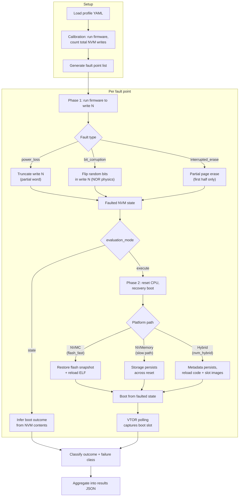

# tardigrade

Fault-injection resilience auditing for embedded bootloaders under [Renode](https://renode.io/).

## What it does

Profile-driven fault injection that exercises NVM write points during a firmware update, injects faults (power loss, bit corruption, interrupted erase), and checks whether the bootloader reaches the expected boot outcome. Designed for Cortex-M firmware under Renode. You bring your ELF and binary images, define success criteria or target-specific state checks in a YAML profile, and tardigrade tells you whether your OTA path survives the exercised faults.

The core engine stays generic: fault injection, replay, semantic-state collection, assertions, invariants, and scenario orchestration live here. Bootloader-specific state probes, invariant providers, formal models, and exploratory generators should live in target-side adapters.

## Quick start: GitHub Action

The narrow CI/canary path is the reusable GitHub Action:

```yaml
- id: tardigrade
  uses: neilberkman/tardigrade@v1
  with:
    profile: profiles/mcuboot_swap_current.yaml
    quick: false # prefer heuristic sweep for real CI signal
    workers: 2
```

Outputs: `verdict` (PASS/FAIL), `brick-rate`, `report-path`. `brick-rate` counts unrecoverable execution failures only; broader slot/hash/invariant issues live in the JSON report.

`quick` remains available for compatibility smoke runs, but it is intentionally shallow. Prefer heuristic mode (`quick: false`) for anything you want to treat as a meaningful gate or canary.

In CI, upload `report-path` as an artifact so failures include the full per-point diagnostics:

```yaml
- name: Upload tardigrade report
  if: always()
  uses: actions/upload-artifact@v4
  with:
    name: tardigrade-report
    path: ${{ steps.tardigrade.outputs.report-path }}
```

The JSON report includes failure context such as `fault_window`, and for `no_boot` points in execute mode, `postmortem_partition_dump` and `resume_trace`.

See [`action.yml`](action.yml) for all inputs and outputs.

## Quick start: local

Prerequisites: `python3`, `pyyaml`, and either `renode-test` on PATH or Docker access for `docker://IMAGE` runs.

```bash
python3 scripts/audit_bootloader.py \
  --profile profiles/mcuboot_pr2100_broken.yaml \
  --renode-test /path/to/renode-test \
  --output results/report.json
```

Add `--quick` only for a smoke test (3 fault points, seconds). It can miss narrow windows. For meaningful local validation, keep the default heuristic sweep and add `--workers 4` for parallelism.

If native Renode is unavailable locally, you can run the same audit through Docker:

```bash
python3 scripts/audit_bootloader.py \
  --profile profiles/mcuboot_pr2100_broken.yaml \
  --renode-test docker://renode-patched:test \
  --output results/report.json
```

## Run modes

| Mode       | Flag              | Points | Time    | Use case        |
| ---------- | ----------------- | ------ | ------- | --------------- |
| Quick      | `--quick`         | 3      | seconds | smoke test      |
| Heuristic  | _(default)_       | ~1K    | 2-4 min | CI gate         |
| Exhaustive | `--fault-start 0` | ~15K   | 15 min  | full validation |

Heuristic mode uses write-trace analysis to prune the ~15K write points down to ~1K high-value targets (trailer boundaries, slot transitions). This is the default CI tradeoff, not a proof of equivalence to an exhaustive sweep.

## Fault injection model



**Flow:**

1. Load profile YAML. Calibration pass counts total NVM writes and records a write trace.
2. Heuristic pruning classifies writes into tiers (trailer=exhaustive, boundary=dense, bulk=sparse) to reduce sweep points ~10x.
3. For each fault point, Phase 1 replays the write trace up to write N and injects the fault. Trace replay eliminates O(N^2) prefix re-emulation.
4. In `state` mode, boot outcome is inferred from NVM contents. In `execute` mode, Phase 2 resets the CPU and performs a recovery boot.
5. Results are classified into observed boot outcomes (`success`, `wrong_image`, `no_boot`, `wrong_pc`) plus a failure class (`recoverable`, `wrong_image`, `silent_corruption`, `unrecoverable`) and aggregated into the final verdict.

For `no_boot` outcomes in runtime execute mode, the result also includes:

- a post-mortem partition dump (slot header/trailer content, erased-sector map, trailer flag bytes)
- an optional second-boot resume trace with per-NVM-operation PC samples

**Fault types:** `power_loss` (partial write), `bit_corruption` (NOR-physics bit flips), `interrupted_erase` (partial page erase), `multi_sector_atomicity` (cross-page partial erase), `silent_write_failure`, `write_rejection` (dropped write), `write_disturb` (adjacent-word corruption), `wear_leveling_corruption` (extra spurious write), `reset_at_time`.

**Evaluation modes:** `state` (fast inference from NVM contents) or `execute` (full CPU recovery boot).

## Included bootloader families

Six architectures, from worst-case patterns to hardened OSS boot flows:

| Family         | Architecture                        | Representative signal                         | Why                                          |
| -------------- | ----------------------------------- | --------------------------------------------- | -------------------------------------------- |
| `naive_copy`   | Copy staging to exec, no fallback   | catastrophic boot-visible failures            | Any mid-copy fault bricks; no recovery path  |
| `vulnerable`   | Copy-in-place with pending flag     | frequent boot-visible failures                | Overwrites only image; mid-copy fault bricks |
| `nxboot_style` | Three-partition copy, CRC, recovery | standalone modeled family; still experimental | Useful target-adapter exercise, not upstream validation yet |
| `esp_idf`      | Dual otadata CRC + rollback FSM     | platform/profile dependent                    | Clean-room model of ESP-IDF OTA selection    |
| `mcuboot`      | Swap-move / swap-scratch on nRF52   | profile dependent, good public validation set | Real MCUboot ELFs from upstream CI           |
| `riotboot`     | Slot selection via header metadata  | profile dependent                             | Standalone RIOTboot model                    |

The repo includes dozens of profiles, including intentional-defect variants for self-testing.

## OSS validation

Retroactive validation against known MCUboot bugs shows the tool catches these observed regression classes:

| PR                                                      | Bug                                                  | Algorithm    | Broken signal        | Fixed signal |
| ------------------------------------------------------- | ---------------------------------------------------- | ------------ | -------------------- | ------------ |
| [#2100](https://github.com/mcu-tools/mcuboot/pull/2100) | Revert magic: `BOOT_MAGIC_BAD` left in REVERT row    | swap-move    | 3 bricks (9.7%)      | 0 issues     |
| [#2109](https://github.com/mcu-tools/mcuboot/pull/2109) | Header reload from wrong slot after interrupted swap | swap-scratch | 19 bricks (33.3%)    | 0 issues     |
| [#2199](https://github.com/mcu-tools/mcuboot/pull/2199) | Stuck revert: primary REVERT trailer never cleared   | swap-move    | 1 wrong_image (100%) | 0 issues     |

Additional differential pairs for PRs [#2205](https://github.com/mcu-tools/mcuboot/pull/2205), [#2206](https://github.com/mcu-tools/mcuboot/pull/2206), and [#2214](https://github.com/mcu-tools/mcuboot/pull/2214) are included as profiles.

## Profile YAML schema

Profiles define everything the audit needs. Annotated example:

```yaml
schema_version: 1
name: mcuboot_pr2100_broken
description: "MCUboot swap-move BEFORE PR #2100 fix"

platform: platforms/cortex_m4_flash_fast.repl # Renode platform definition

bootloader:
  elf: results/oss_validation/assets/oss_mcuboot_pr2100_broken.elf
  entry: 0x00000000

memory:
  sram: { start: 0x20000000, end: 0x20040000 }
  write_granularity: 4
  slots:
    exec: { base: 0x0000C000, size: 0x76000 }
    staging: { base: 0x00082000, size: 0x76000 }

images:
  exec: results/oss_validation/assets/zephyr_slot1_padded.bin
  staging: results/oss_validation/assets/zephyr_slot0_padded.bin

pre_boot_state: # Seed NVM with specific state
  - { address: 0x00081FF0, u32: 0xF395C277 } # MCUboot trailer magic
  # ...

success_criteria:
  marker_address: 0x0000C014 # Check image header version
  marker_value: 0x00000001 # Expected value after revert

fault_sweep:
  mode: runtime
  evaluation_mode: execute
  max_writes: auto
  boot_cycles: 3
  hash_bypass_symbols: ["bootutil_img_validate"] # Patch out crypto in emulation

semantic_assertions:
  control:
    multi_boot_analysis.status: converged
  faulted:
    semantic_state.confirmed: false

state_probe:
  script: scripts/probes/my_target_probe.py
  format: tardigrade.semantic-state/v1
  contract_version: 1
  required_paths:
    - semantic_state.confirmed

invariants:
  - multi_boot_converges
invariant_providers:
  - targets/my_bootloader/invariants.py

expect:
  should_find_issues: true # Self-test: tool must find issue points
  # Optional for semantic-only discovery profiles:
  allow_semantic_only_issues: false
  required_issue_reasons: ["boot_outcome"]
```

Key fields: `platform`, `bootloader`, `memory`, `images`, `success_criteria`, `fault_sweep`, `expect`. See [`scripts/profile_loader.py`](scripts/profile_loader.py) for the full schema.

### Discovery-oriented profile hooks

- `state_probe`: profile-supplied semantic-state contract. `script` is the probe implementation; `format` and `contract_version` document the JSON shape; `required_paths` marks fields that must be observed for the probe contract to count as satisfied.
- `state_probe_script`: legacy shorthand for `state_probe.script`; still supported for compatibility.
- `semantic_assertions`: path-based expectations over the runtime result (`semantic_state.*`, `multi_boot_analysis.*`, etc.). A point can fail even when the device still boots.
- Missing semantic observations are reported separately from assertion failures so incomplete probes do not automatically look like discovered bugs.
- `invariants`: named postconditions such as `multi_boot_converges` that run against the normalized result payload.
- `invariant_providers`: external Python modules that register additional invariant checks without extending the core registry.
- `fault_sweep.boot_cycles`: repeat clean boots after the initial control or faulted boot to catch stuck-revert or oscillation bugs that require more than one reboot.
- `expect.allow_semantic_only_issues` and `expect.required_issue_reasons`: self-test controls for profiles that intentionally expect semantic-only discoveries instead of boot-visible failures.

## Generic scenarios and replay

Use [`scripts/run_scenario.py`](scripts/run_scenario.py) to orchestrate multi-step discovery runs without baking target semantics into the core. A scenario references a base profile and then runs `audit` or `replay` steps by applying generic profile overrides.

In practice, the repo exposes two complementary public surfaces:

- `audit_bootloader.py --profile ...` or the reusable GitHub Action for narrow CI/canary use
- `run_scenario.py` plus target-side adapters under `targets/*` for exploratory validation

Public examples:

- [`scenarios/mcuboot_head_exploratory.yaml`](scenarios/mcuboot_head_exploratory.yaml) attaches a target-side probe and invariant provider to the public `mcuboot_head_upgrade` and `mcuboot_head_revert` profiles, then checks both paths through the generic scenario runner.
- [`scenarios/nxboot_style_exploratory.yaml`](scenarios/nxboot_style_exploratory.yaml) is a standalone modeled-family exercise for the generic scenario/probe/invariant surfaces. It is useful as a public adapter example, but it should not be read as a validated upstream `nxboot`/NuttX canary yet.

Replay specs are generic override bundles, suitable for counterexamples from CBMC or any other model checker:

```yaml
schema_version: 1
kind: replay
name: example_counterexample
source:
  type: cbmc
  property: boot_target_never_null
profile_overrides:
  pre_boot_state:
    - { address: 0x10070000, u32: 0x00000001 }
  expect:
    should_find_issues: true
```

`scripts/cbmc_to_profile.py` can now emit these replay specs directly via `--replay-output`.

## Performance

Optimizations that make profile sweeps feasible on CI runners:

- **Trace replay** -- calibration records every write address+value; sweep replays from trace (~20ms) instead of re-emulating Phase 1, eliminating O(N^2) prefix cost
- **Cached flash restore** -- single `WriteBytes` call per fault point instead of per-page erase+load
- **VTOR early exit** -- polling detects boot slot quickly; HardFault confirmation avoids false negatives
- **Hash bypass** -- patches out crypto validation in emulation (`hash_bypass_symbols` in profile)
- **Parallel workers** -- `--workers N` splits fault points across N Renode instances
- **Heuristic pruning** -- write-trace classification reduces ~15K points to ~1K for routine CI sweeps; exhaustive runs remain the higher-confidence mode
- **Interleaved distribution** -- round-robin point assignment balances load across workers

## Execute-mode hardening

In `execute` mode, Phase 2 performs a full CPU recovery boot from faulted flash:

- **VTOR polling**: after each time slice, the VTOR register (`0xE000ED08`) is polled to detect which slot the bootloader jumped to. SCB registers are CPU-private, so watchpoints don't fire -- polling is required.
- **5ms confirmation window + CFSR HardFault check**: after a VTOR change is detected, a confirmation window verifies the boot is stable and checks for HardFault via the Configurable Fault Status Register.
- **Sticky fault signal**: `FaultEverFired` stays set once any fault fires, surviving subsequent writes and resets. Explicitly cleared only when a new iteration is armed.
- **Write stabilization early-exit**: `run_until_done` exits when writes stabilize across multiple time slices, reducing per-point runtime without losing coverage.
- **No-boot introspection hooks**: when a point ends in `no_boot`, tardigrade can emit a partition post-mortem dump and replay a second recovery boot with per-operation PC tracing to show where resume logic stalls.

## Report structure

Primary report fields:

- `summary.runtime_sweep`: aggregate outcomes (`failure_outcomes`), aggregate failure classes (`failure_classes`), brick rate, issue rate, control result, and timing.
- `runtime_sweep_results[]`: per-point records with `fault_type`, `boot_outcome`, `fault_class`, `signals`, and optional diagnostics such as `semantic_state`, `boot_cycles`, `multi_boot_analysis`, `semantic_assertion_failures`, and `invariant_violations`.
- `semantic_observation_failures`: reported when a probe did not export a requested semantic field; these are observation gaps, not verdict-driving failures by default.
- `clean_trace`: calibration-trace metadata when available (write/erase counts and how many points were window-annotated).

`bricks` counts unrecoverable observed execution failures. Use `issue_points` when you care about broader expectation mismatches such as wrong slot/image, semantic assertions, or invariant violations.

Per-point diagnostics are attached only when relevant:

- `fault_window`: clean-run context around the injected operation (`before`, `at`, `after`) so you can map a failing point to adjacent NVM operations.
- `postmortem_partition_dump`: for `no_boot`, slot header/trailer raw data plus decoded structure (header validity, trailer flags, erased-sector map).
- `resume_trace`: for `no_boot`, a second boot from the faulted flash snapshot with per-NVM-operation PC samples.

## CI workflows

| Workflow                   | Trigger                        | What it does                                                |
| -------------------------- | ------------------------------ | ----------------------------------------------------------- |
| `ci.yml`                   | push, PR                       | Robot suites + sharded self-test                            |
| `profile-sweep.yml`        | workflow_dispatch              | On-demand single-profile sweep with optional exhaustive mode |
| `action-validation.yml`    | push, PR                       | Validates the reusable GitHub Action                        |
| `oss-validation.yml`       | push to `main`, schedule, manual | Runs selected OSS validation guards                         |
| `mcuboot-head-exploratory.yml` | workflow_dispatch          | Runs the public MCUboot exploratory scenario via `run_scenario.py` |
| `nxboot-style-exploratory.yml` | workflow_dispatch         | Builds the standalone `nxboot_style` model and runs its experimental exploratory scenario |
| `renode-latest-canary.yml` | schedule, workflow_dispatch    | Tests against latest Renode build                           |

## Repository layout

```text
tardigrade/
├── action.yml                                   # Reusable GitHub Action
├── peripherals/
│   ├── NVMemoryController.cs                    # NVMemory + controller with fault hooks
│   ├── NRF52NVMC.cs                             # nRF52 NVMC with write/erase tracking
│   ├── GenericNvmController.cs                  # Configurable command/address/data NVM
│   ├── TraceReplayEngine.cs                     # Native trace replay for fast sweeps
│   ├── NRF52UARTE.cs                            # UART stub for nRF52 platforms
│   └── SimpleCacheController.cs                 # Cache controller stub
├── platforms/                                   # Renode platform definitions (.repl)
├── profiles/                                    # 68 YAML audit profiles
├── scripts/
│   ├── audit_bootloader.py                      # Profile-driven audit runner (primary CLI)
│   ├── profile_loader.py                        # YAML profile parser + validation
│   ├── self_test.py                             # Meta-test: audit catches the repo's known defect corpus
│   ├── run_runtime_fault_sweep.resc             # Renode runtime fault sweep engine
│   ├── write_trace_heuristic.py                 # Write-trace classification for pruning
│   ├── render_results_html.py                   # HTML report renderer
│   ├── run_oss_validation.py                    # OSS profile orchestrator
│   ├── mcuboot_state_fuzzer.py                  # Compatibility wrapper to targets/mcuboot/state_fuzzer.py
│   ├── geometry_matrix.py                       # Parametric slot-layout generator
│   └── cbmc_to_profile.py                       # CBMC counterexample → profile converter
├── targets/
│   ├── mcuboot/
│       ├── probe.py                              # MCUboot trailer-state semantic probe
│       ├── invariants.py                         # MCUboot-specific invariant provider
│       └── state_fuzzer.py                      # MCUboot-specific trailer state exploration
│   └── nxboot/
│       ├── probe.py                              # nxboot-style semantic probe
│       └── invariants.py                         # nxboot-style invariant provider
├── scenarios/
│   ├── mcuboot_head_exploratory.yaml            # Public MCUboot multi-step scenario
│   └── nxboot_style_exploratory.yaml            # Experimental standalone nxboot-style scenario
├── examples/                                    # Built-in bootloader firmware
│   ├── naive_copy/
│   ├── vulnerable_ota/
│   ├── nxboot_style/
│   ├── esp_idf_ota/
│   └── riotboot_standalone/
├── tests/                                       # Robot Framework test suites
└── results/oss_validation/assets/               # Pre-built MCUboot ELFs + slot images
```

## Writing your own profile

1. Build your bootloader ELF and slot binary images.
2. Pick or create a Renode platform (`.repl`) that matches your memory map.
3. Write a profile YAML: define `platform`, `bootloader`, `memory.slots`, `images`, and `success_criteria`.
4. Run:

```bash
python3 scripts/audit_bootloader.py \
  --profile your_profile.yaml \
  --renode-test /path/to/renode-test \
  --output results/your_report.json
```

See the included profiles for examples covering NVMemory, NVMC, and hybrid platforms.

## Beyond the primary audit

The main workflow is `audit_bootloader.py --profile`, but the repo includes deeper analysis tools for bootloader authors:

- **Geometry matrix** (`scripts/geometry_matrix.py`) -- generates parametric slot-layout permutations (alignment, sector size, slot count) to catch geometry-dependent bugs. This is how PR [#2206](https://github.com/mcu-tools/mcuboot/pull/2206) was validated across layout variants.
- **State fuzzer** (`targets/mcuboot/state_fuzzer.py`) -- MCUboot-specific trailer-state exploration. Kept outside the core namespace so target logic stays separate from generic discovery plumbing.
- **CBMC bridge** (`scripts/cbmc_to_profile.py`) -- converts CBMC counterexamples over modeled metadata/state into tardigrade profiles for dynamic replay. Bridges static and dynamic analysis when the counterexample can be projected into a concrete pre-boot state.

## Limitations

- Fault model operates at write-operation granularity, not analog brownout simulation.
- Cortex-M targets currently; non-Cortex architectures are not first-class.
- Semantic/state-only bugs that do not change boot outcome require explicit instrumentation or stronger target-specific oracles.
- Full exhaustive sweeps take ~15 min on a 2-core CI runner; heuristic mode usually reduces this to 2-4 min, but it remains a coverage/performance tradeoff.

## Why "tardigrade"

Tardigrades are microscopic animals known for surviving extreme conditions: vacuum, radiation, and severe temperature swings. That maps directly to the goal of this project -- OTA update paths that stay recoverable even under harsh power and storage fault conditions.

## License

Apache 2.0. See `LICENSE`.
