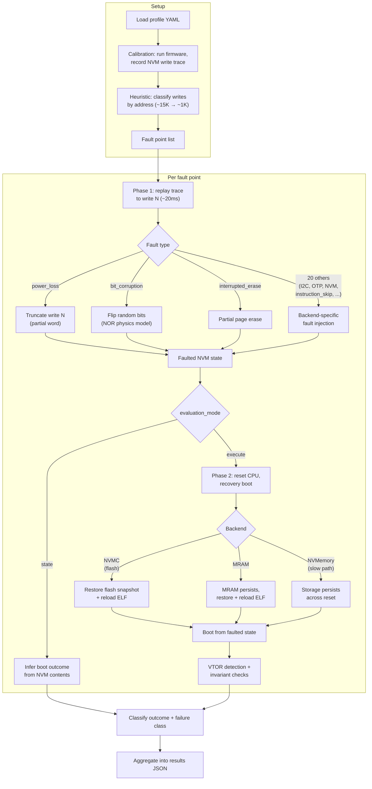

# tardigrade

High-speed fault-injection testing for embedded OTA bootloaders. Tardigrade systematically injects NVM faults along the firmware update path under [Renode](https://renode.io/) emulation, then checks whether the device recovers -- going beyond boot/no-boot to catch state-correctness bugs that corrupt the update state machine without necessarily bricking the device.

Trace replay and write-address heuristics make exhaustive fault sweeps (~15K points) feasible in minutes, not hours -- fast enough for CI gating. An optional CBMC bridge connects formal verification to empirical testing by converting counterexamples into replay profiles.

## Findings

### NuttX nxboot -- original discovery

Tardigrade's fault sweep against the upstream [NuttX nxboot bootloader](https://github.com/apache/nuttx-apps/tree/master/boot/nxboot) found a power-loss recovery vulnerability: 92 of 94 fault points resulted in the bootloader jumping to partially-written firmware. Three fixes submitted:

| Fix                                                                                         | PR                                                                       |
| ------------------------------------------------------------------------------------------- | ------------------------------------------------------------------------ |
| FTL layer ignores `O_DIRECT` flag -- writes buffered in RAM despite explicit bypass request | [apache/nuttx#18552](https://github.com/apache/nuttx/pull/18552)         |
| Missing flush barriers between critical partition writes in nxboot                          | [apache/nuttx-apps#3428](https://github.com/apache/nuttx-apps/pull/3428) |
| Boot decision validates header only, not image CRC                                          | [apache/nuttx-apps#3428](https://github.com/apache/nuttx-apps/pull/3428) |

The FTL `O_DIRECT` bug affects all NuttX applications that write to MTD partitions expecting direct access, not just nxboot.

### MCUboot -- retroactive validation

These are retroactive tests against known MCUboot bugs, not discoveries. The point is showing that tardigrade's generic sweep catches real bug classes without target-specific tuning:

| PR                                                      | Bug                                                                 | Broken               | Fixed    |
| ------------------------------------------------------- | ------------------------------------------------------------------- | -------------------- | -------- |
| [#2100](https://github.com/mcu-tools/mcuboot/pull/2100) | Revert magic left in bad state (swap-move)                          | 3 bricks (9.7%)      | 0 bricks |
| [#2109](https://github.com/mcu-tools/mcuboot/pull/2109) | Header reload from wrong slot after interrupted swap (swap-scratch) | 19 bricks (33.3%)    | 0 bricks |
| [#2199](https://github.com/mcu-tools/mcuboot/pull/2199) | Stuck revert: primary trailer never cleared (swap-move)             | 1 wrong_image (100%) | 0 issues |

Additional differential profiles for PRs [#2205](https://github.com/mcu-tools/mcuboot/pull/2205), [#2206](https://github.com/mcu-tools/mcuboot/pull/2206), and [#2214](https://github.com/mcu-tools/mcuboot/pull/2214).

## Integrations

### Fuzzer bridge

[`scripts/fuzz_crash_to_profile.py`](scripts/fuzz_crash_to_profile.py) converts libFuzzer/AFL/honggfuzz crash artifacts into tardigrade regression profiles. When a fuzzer finds a crash that corrupts an OTA header or metadata region, the bridge tests whether the corruption actually bricks the device or whether the bootloader recovers. Pipeline: `fuzzer finds crash` → `fuzz_crash_to_profile.py` → `tardigrade sweep from corrupted state`. Supports batch mode, staging-image injection, and auto-detection of fuzzer types.

### Formal verification bridge (CBMC)

[`scripts/cbmc_to_profile.py`](scripts/cbmc_to_profile.py) converts CBMC counterexamples into tardigrade replay profiles. CBMC proves a fault sequence _could_ cause corruption at the source level; tardigrade runs the compiled firmware under that sequence to confirm whether it manifests in practice. The bridge maps source-level state violations to NVM write indices using the counterexample's variable traces and the calibration write log.

## How it works

### Trace replay engine

Naive fault injection re-emulates the entire firmware prefix for each fault point -- O(N^2) total emulation for N fault points. Tardigrade records a write trace during calibration, then replays it from the trace file (~20ms) instead of re-emulating Phase 1. This is what makes 15,000-point exhaustive sweeps feasible in minutes instead of hours.

### Write-address heuristic

Not all NVM writes are equally interesting. The heuristic classifier (`scripts/write_trace_heuristic.py`) analyzes write addresses and groups them into tiers: trailer metadata (exhaustive coverage), slot boundaries (dense sampling), and bulk data copies (sparse sampling). Result: ~10x reduction in sweep points while preserving coverage of the writes most likely to cause state-machine corruption. This makes fault injection practical for CI pipelines.

### Semantic assertions beyond boot/no-boot

A device that boots to the wrong slot, confirms a corrupt image, or gets stuck in a revert loop is not "working." Tardigrade's state probes, semantic assertions, and composable invariant providers catch state-correctness bugs that pass a naive boot check. PR #2199 (stuck revert) is an example: the device boots, but it boots the wrong image permanently. Tardigrade catches it.

Instruction-skip sweeps can also attach verification bypass probes that record per-function return values instead of relying only on the final boot outcome. This lets tardigrade separate noisy CPU crashes from defense-in-depth catches and true full verification bypasses, which cuts down the false positives that otherwise show up in glitch-style campaigns.

### Write-back durability model

Real storage stacks often buffer writes in RAM before committing to flash. A bootloader that assumes write-through durability can have latent bugs invisible to direct fault injection. The optional `durability_model: writeback` mode adds a volatile overlay between the bootloader's writes and physical flash -- writes accumulate in the overlay, explicit barriers commit them, and power-loss discards uncommitted data. This exposes missing flush barriers without requiring the firmware to be built with a specific storage configuration.

Diagnostic annotations include a barrier audit (detects missing flush barriers between update phases), per-fault dirty-domain state, and a `commit_ratio` metric that quantifies how much of the write stream is uncommitted at each fault point.

## Quick start

### GitHub Action

```yaml
- id: tardigrade
  uses: neilberkman/tardigrade@v1
  with:
    profile: profiles/mcuboot_swap_current.yaml
    quick: false
    workers: 2
```

Outputs: `verdict` (PASS/FAIL), `report-path`, `brick-rate`. Use `verdict` as the CI gate signal.

```yaml
- name: Upload tardigrade report
  if: always()
  uses: actions/upload-artifact@v4
  with:
    name: tardigrade-report
    path: ${{ steps.tardigrade.outputs.report-path }}
```

See [`action.yml`](action.yml) for all inputs and outputs.

### Local

Prerequisites: `python3`, `python3 -m pip install -r requirements.txt`, and either `renode-test` on PATH or Docker.

```bash
python3 scripts/audit_bootloader.py \
  --profile profiles/mcuboot_pr2100_broken.yaml \
  --renode-test /path/to/renode-test \
  --output results/report.json
```

`--quick` runs a 3-point smoke test. Default is the heuristic sweep (~1K points, 2-4 min). Add `--workers N` for parallelism. Docker: `--renode-test docker://renode-patched:test`.

### Run modes

| Mode       | Flag              | Points | Time    | Use case               |
| ---------- | ----------------- | ------ | ------- | ---------------------- |
| Quick      | `--quick`         | 3      | seconds | smoke only             |
| Heuristic  | _(default)_       | ~1K    | 2-4 min | normal CI / canary     |
| Exhaustive | `--fault-start 0` | ~15K   | 15 min  | deep manual validation |

## How it works

### Fault injection model


```mermaid
flowchart TD
    subgraph setup["Setup"]
        A["Load profile YAML"] --> B["Calibration: run firmware,<br/>record NVM write trace"]
        B --> C["Heuristic: classify writes<br/>by address (~15K → ~1K)"]
        C --> D["Fault point list"]
    end

    D --> E

    subgraph pf["Per fault point"]
        E["Phase 1: replay trace<br/>to write N (~20ms)"] --> F{"Fault type"}
        F -->|power_loss| G["Truncate write N<br/>(partial word)"]
        F -->|bit_corruption| H["Flip random bits<br/>(NOR physics model)"]
        F -->|interrupted_erase| I["Partial page erase"]
        F -->|"20 others<br/>(I2C, OTP, NVM,<br/>instruction_skip, ...)"| J["Backend-specific<br/>fault injection"]

        G --> K["Faulted NVM state"]
        H --> K
        I --> K
        J --> K

        K --> L{"evaluation_mode"}

        L -->|state| M["Infer boot outcome<br/>from NVM contents"]
        L -->|execute| N["Phase 2: reset CPU,<br/>recovery boot"]

        N --> O{"Backend"}
        O -->|"NVMC<br/>(flash)"| P["Restore flash snapshot<br/>+ reload ELF"]
        O -->|"MRAM"| Q["MRAM persists,<br/>restore + reload ELF"]
        O -->|"NVMemory<br/>(slow path)"| R["Storage persists<br/>across reset"]

        P --> S["Boot from faulted state"]
        Q --> S
        R --> S
        S --> T["VTOR detection +<br/>invariant checks"]
    end

    M --> U
    T --> U
    U["Classify outcome + failure class"] --> V["Aggregate into results JSON"]
```

1. **Calibration** -- run the firmware once, count total NVM writes, record a write trace.
2. **Heuristic pruning** -- classify writes by address into tiers, reduce sweep points ~10x.
3. **Phase 1** -- replay the write trace up to write N and inject the fault (trace replay eliminates O(N^2) prefix re-emulation).
4. **Phase 2** -- `execute` mode resets the CPU and performs a full recovery boot from faulted NVM; `state` mode infers the outcome from NVM contents alone.
5. **Follow-up cycles / hooks** -- optional repeated boots and between-cycle hook actions model confirm-or-rollback flows and staged recovery.
6. **Classification** -- boot outcomes (`success`, `wrong_image`, `no_boot`, `wrong_pc`, `hard_fault`, `timeout`) and failure classes (`recoverable`, `wrong_image`, `silent_corruption`, `unrecoverable`). A `timeout` means the bootloader was still actively working when the wall-clock budget expired -- this is not counted as a failure.

### Fault types

23 fault types across 7 backend categories:

| Category        | Fault types                                                                                                                                                           | Backend              |
| --------------- | --------------------------------------------------------------------------------------------------------------------------------------------------------------------- | -------------------- |
| NVM write/erase | `power_loss`, `bit_corruption`, `interrupted_erase`, `silent_write_failure`, `write_disturb`, `write_rejection`, `multi_sector_atomicity`, `wear_leveling_corruption` | All                  |
| NVM read/time   | `read_bit_flip`, `reset_at_time`                                                                                                                                      | NVMemory, MRAM / All |
| NVM controller  | `command_drop`                                                                                                                                                        | GenericNvmController |
| NVM region      | `bootloader_region_write`, `nvs_corruption`                                                                                                                           | All                  |
| CPU glitch      | `instruction_skip`                                                                                                                                                    | All                  |
| Driver error    | `driver_error` (peripheral sets error status register), `rc_injection` (forces flash write return code to -EIO at software level)                                     | All                  |
| I2C bus         | `i2c_nack`, `i2c_timeout`, `i2c_bit_flip`, `i2c_truncated`, `i2c_wrong_address`                                                                                       | I2CFaultProxy        |
| OTP fuse        | `otp_partial_program`, `otp_stuck_bit`, `otp_read_disturb`, `otp_overblow`                                                                                            | OTPMemory            |

Faults can be injected at different lifecycle stages: during the initial update write path, during pre-boot metadata/setup writes (`metadata_fault`), during between-boot confirm/accept hooks (`hook_fault`), during the recovery write path itself (`phase2_fault`), or as compound sequences (`multi_fault`). The optional `durability_model: writeback` composes with any fault type to simulate write-buffering storage stacks.

### Execute-mode hardening

In `execute` mode, Phase 2 performs a full CPU recovery boot from faulted NVM:

- **VTOR polling** detects which slot the bootloader jumped to.
- **5ms confirmation window + CFSR HardFault check** verifies boot stability.
- **Sticky fault signal** (`FaultEverFired`) survives subsequent writes and resets.
- **Write stabilization early-exit** reduces per-point runtime when writes settle.
- **No-boot introspection** emits partition post-mortem dumps and per-operation PC traces for `no_boot` outcomes.

### Performance

- **Trace replay** -- recorded trace replay (~20ms) replaces full Phase 1 re-emulation
- **Cached flash restore** -- single `WriteBytes` per fault point instead of per-page erase+load
- **Hash bypass** -- patches out crypto validation on faulted sweep runs via `sweep_hash_bypass_symbols`
- **Parallel workers** -- `--workers N` distributes fault points across N Renode instances
- **Heuristic pruning** -- ~15K to ~1K points for routine CI
- **Interleaved distribution** -- round-robin assignment balances load across workers

## Profile-driven architecture

Sweeps are purely declarative YAML -- describe the memory layout, slots, images, and success criteria. Advanced semantic checking (state probes, custom invariants, boot register capture, write-order constraints) requires small Python hooks. A `security_policy` block models anti-rollback floors, minimum version enforcement, and TOCTOU protection for adversarial fault scenarios.

See **[`docs/writing-profiles.md`](docs/writing-profiles.md)** for the complete profile-writing guide: field-by-field reference, platform selection, success criteria options, invariant configuration, and result interpretation.

## Supported targets

### Real upstream integrations

**MCUboot** -- narrow canary profiles against MCUboot HEAD, retroactive differential profiles for 6 known bugs (broken/fixed pairs for PRs #2100, #2109, #2199, #2205, #2206, #2214), geometry-variant profiles, and multi-step exploratory scenarios with semantic probes and invariant checking. Platforms include nRF52840 (NVMC) and STM32F4. The MCUboot differentials cover three distinct fault-resilience bug classes (revert-magic corruption, header-reload-after-resume, stuck-revert-trailer) -- each was also checked against the other swap algorithms to test for cross-algorithm variants. See `profiles/mcuboot_*.yaml` and [`targets/mcuboot/`](targets/mcuboot/).

**NuttX nxboot** -- real upstream NuttX firmware built from source. Board configs are upstream ([apache/nuttx#18509](https://github.com/apache/nuttx/pull/18509)). Tardigrade found a power-loss recovery vulnerability (92/94 failure rate) that led to fixes in both the NuttX kernel ([#18552](https://github.com/apache/nuttx/pull/18552)) and nxboot itself ([nuttx-apps#3428](https://github.com/apache/nuttx-apps/pull/3428)). The target adapter (`targets/nuttx_nxboot/`) includes a build script, runtime profile generator, and state probe. See [`targets/nuttx_nxboot/`](targets/nuttx_nxboot/).

**rustBoot** -- initial real upstream nRF52840 integration using checked-in public assets, a rustBoot-specific state probe/invariant package, and a first interrupted-erase campaign over the swap-scratch update path. Current limitation: the fast nRF52 backend does not yet recover write-index traces from rustBoot's NVMC usage, so the shipped profile is erase-fault focused and expected to find issues. See [`profiles/rustboot_nrf52840_update.yaml`](profiles/rustboot_nrf52840_update.yaml), [`targets/rustboot/`](targets/rustboot/), and [`docs/rustboot-target.md`](docs/rustboot-target.md).

### Reference examples

The `examples/` directory contains standalone bootloader firmware for engine validation and self-testing:

| Example                  | Purpose                                                            |
| ------------------------ | ------------------------------------------------------------------ |
| `naive_copy`             | Worst-case baseline; proves the engine catches obvious brick paths |
| `vulnerable_ota`         | Copy-in-place OTA with frequent boot-visible failures              |
| `nxboot_style`           | Modeled nxboot family for adapter/probe/invariant development      |
| `esp_idf_ota`            | Clean-room model of ESP-IDF OTA slot-selection behavior            |
| `riotboot_standalone`    | Standalone RIOTboot-style slot-selection model                     |
| `bootloader_self_update` | Bootloader-region integrity and self-update fault modeling         |
| `nvs_config_migration`   | Config/NVS-region corruption and migration validation              |

## Report structure

Top-level verdict is `PASS` or `FAIL` -- use this as the CI gate signal. `bricks` counts unrecoverable failures (device didn't boot). `issue_points` includes broader mismatches (wrong slot, semantic assertions, invariant violations). `timeout_points` counts fault points where the bootloader was still actively working when the wall-clock budget expired -- these are not failures (increase `run_duration` to resolve). Boot outcomes: `success`, `wrong_image`, `no_boot`, `wrong_pc`, `hard_fault`, `timeout`.

See **[`docs/writing-profiles.md`](docs/writing-profiles.md)** for the full report JSON structure and how to interpret results.

## Additional tools

- **Scenarios** ([`scripts/run_scenario.py`](scripts/run_scenario.py)) -- multi-step discovery runs with profile overrides per step. See [`scenarios/`](scenarios/).
- **CBMC bridge** ([`scripts/cbmc_to_profile.py`](scripts/cbmc_to_profile.py)) -- converts CBMC counterexamples into tardigrade replay profiles, bridging formal verification and empirical fault injection.
- **Fuzzer bridge** ([`scripts/fuzz_crash_to_profile.py`](scripts/fuzz_crash_to_profile.py)) -- converts libFuzzer/AFL/honggfuzz crash inputs into regression profiles; supports batch mode, staging-image injection, and auto-detection of fuzzer types. Workflow helpers live in [`scripts/fuzz_corpus.py`](scripts/fuzz_corpus.py), with an end-to-end template in [`examples/fuzzer_harness/`](examples/fuzzer_harness/). Legacy converter: `scripts/fuzz_to_profile.py`.
- **Geometry matrix** ([`scripts/geometry_matrix.py`](scripts/geometry_matrix.py)) -- parametric slot-layout permutations to catch geometry-dependent bugs.
- **State fuzzer** -- structured metadata-state fuzzing via the `state_fuzzer` profile block, plus the MCUboot-specific scenario generator in [`targets/mcuboot/state_fuzzer.py`](targets/mcuboot/state_fuzzer.py).
- **HTML report** ([`scripts/render_results_html.py`](scripts/render_results_html.py)) -- renders JSON reports as HTML.

## CI workflows

| Workflow                              | Trigger                  | What it does                          |
| ------------------------------------- | ------------------------ | ------------------------------------- |
| `ci.yml`                              | push, PR                 | Robot suites + sharded self-test      |
| `profile-sweep.yml`                   | workflow_dispatch        | On-demand single-profile sweep        |
| `action-validation.yml`               | push, PR                 | Validates the reusable GitHub Action  |
| `oss-validation.yml`                  | push to `main`, schedule | OSS validation guards                 |
| `mcuboot-head-exploratory.yml`        | workflow_dispatch        | MCUboot exploratory scenario          |
| `nuttx-nxboot-real-exploratory.yml`   | workflow_dispatch        | Real NuttX nxboot exploratory sweep   |
| `nuttx-nxboot-revert-canary.yml`      | schedule, dispatch       | NuttX revert property canary          |
| `nuttx-nxboot-multi-fault-canary.yml` | schedule, dispatch       | NuttX nxboot multi-fault sweep canary |
| `renode-latest-canary.yml`            | schedule, dispatch       | Tests against latest Renode build     |

## Repository layout

```text
tardigrade/
├── action.yml                        # Reusable GitHub Action
├── scripts/
│   ├── audit_bootloader.py           # Primary CLI entry point
│   ├── run_scenario.py               # Multi-step scenario runner
│   ├── profile_loader.py             # YAML profile parser + validation
│   ├── invariants.py                 # 14 built-in postcondition invariants
│   ├── self_test.py                  # Self-test across known defect corpus
│   ├── run_runtime_fault_sweep.resc  # Renode fault sweep engine
│   ├── write_trace_heuristic.py      # Write-trace classification
│   ├── boot_cycle_analysis.py        # Multi-boot convergence analysis
│   ├── fault_inject.py               # Fault injection helpers
│   ├── partial_staging.py            # Partial staging-image simulation
│   ├── render_results_html.py        # HTML report renderer
│   ├── geometry_matrix.py            # Parametric slot-layout generator
│   ├── cbmc_to_profile.py            # CBMC counterexample converter
│   ├── fuzz_crash_to_profile.py      # Fuzzer crash-to-profile converter
│   ├── fuzz_to_profile.py            # Legacy fuzzer bridge
│   └── run_oss_validation.py         # OSS validation runner
├── targets/
│   ├── mcuboot/                      # MCUboot probe, invariants, state fuzzer
│   ├── nuttx_nxboot/                 # Real NuttX build + runtime profile gen
│   └── nxboot/                       # Shared nxboot-style probe + invariants
├── profiles/                         # YAML audit profiles (~140 profiles)
├── scenarios/                        # Multi-step scenario definitions
├── examples/                         # Built-in reference bootloader firmware
├── harnesses/                        # Fuzzer harness templates
├── peripherals/                      # Renode C# peripherals with fault hooks
│   ├── NRF52NVMC.cs                  #   NVMC flash with write/erase faults
│   ├── NVMemoryController.cs         #   NVMemory slow-path backend
│   ├── GenericNvmController.cs       #   Command-register NVM controller
│   ├── I2CFaultProxy.cs              #   I2C bus fault injection proxy
│   ├── OTPMemory.cs                  #   OTP fuse-blow fault model
│   ├── STM32F4FlashController.cs     #   STM32F4 flash controller
│   ├── STM32H7FlashController.cs     #   STM32H7 flash controller
│   ├── TraceReplayEngine.cs          #   Trace replay for fast Phase 1
│   └── FaultTracker.cs               #   Shared fault-tracking + writeback overlay
├── platforms/                        # Renode platform definitions (.repl)
├── tests/                            # Robot Framework + pytest suites
├── docker/                           # Dockerfiles for CI
├── results/oss_validation/assets/    # Pre-built MCUboot ELFs + slot images
└── docs/
    ├── writing-profiles.md           # Profile-writing guide + result interpretation
    ├── i2c-fault-model.md            # I2C fault injection model
    └── otp-backend.md                # OTP fuse-blow backend
```

## Limitations

- Fault model operates at write-operation granularity, not analog brownout simulation.
- Cortex-M targets only; non-Cortex architectures are not first-class.
- Some fault types are backend-specific: `read_bit_flip` requires a backend that intercepts CPU reads (NVMemory or MRAMMemory -- fast-path backends like NVMC/STM32 expose flash via MappedMemory that the CPU reads directly); `command_drop` requires GenericNvmController; I2C faults require the I2CFaultProxy peripheral; OTP faults require the OTPMemory peripheral. The profile loader warns at load time for incompatible combinations.
- Multi-fault sweeps currently execute all stages as power-loss faults regardless of the original fault type.
- Semantic bugs that don't change boot outcome require explicit target instrumentation.
- Exhaustive sweeps take ~15 min on a 2-core CI runner; heuristic mode is 2-4 min.

## Why "tardigrade"

Tardigrades survive vacuum, radiation, and temperature extremes. The name maps to the goal: OTA update paths that stay recoverable under harsh fault conditions.

## License

Apache 2.0. See `LICENSE`.
