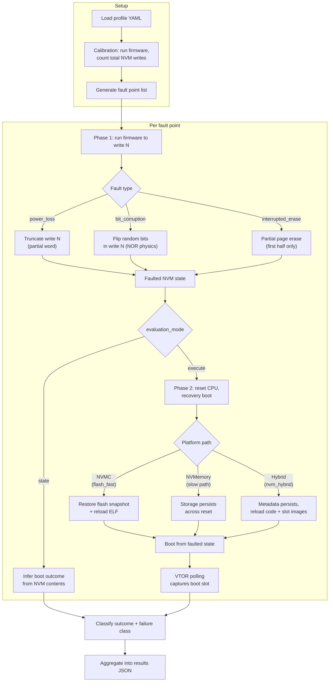

# tardigrade

Fault-injection testing for embedded OTA bootloaders. Answers one question: **if power dies mid-update, does the device recover?**

Tardigrade runs your bootloader under [Renode](https://renode.io/), systematically faults every NVM write in the update path, and checks whether the device still reaches the boot outcome you intended.

### Proven results

Retroactive validation against known MCUboot bugs (catches the broken commit, passes the fixed one):

| PR                                                      | Bug                                                                 | Signal               |
| ------------------------------------------------------- | ------------------------------------------------------------------- | -------------------- |
| [#2100](https://github.com/mcu-tools/mcuboot/pull/2100) | Revert magic left in bad state (swap-move)                          | 3 bricks (9.7%)      |
| [#2109](https://github.com/mcu-tools/mcuboot/pull/2109) | Header reload from wrong slot after interrupted swap (swap-scratch) | 19 bricks (33.3%)    |
| [#2199](https://github.com/mcu-tools/mcuboot/pull/2199) | Stuck revert: primary trailer never cleared (swap-move)             | 1 wrong_image (100%) |

Additional differential profiles for PRs [#2205](https://github.com/mcu-tools/mcuboot/pull/2205), [#2206](https://github.com/mcu-tools/mcuboot/pull/2206), and [#2214](https://github.com/mcu-tools/mcuboot/pull/2214).

The public flagship integrations are MCUboot and real NuttX `nxboot`. The built-in example families still matter, but as an engine-validation matrix: they exercise controlled fault classes, provide intentional broken/fixed cases for self-test, and let new generic features be proven before a real upstream target uses them.

## Quick start: GitHub Action

```yaml
- id: tardigrade
  uses: neilberkman/tardigrade@v1
  with:
    profile: profiles/mcuboot_swap_current.yaml
    quick: false
    workers: 2
```

Outputs: `verdict` (PASS/FAIL), `report-path`, `brick-rate`. Use `verdict` as the CI gate signal.

`brick-rate` is intentionally narrow: it counts only unrecoverable execution failures. Broader mismatches such as wrong slot/image, semantic assertion failures, or invariant violations show up in the JSON report under `issue_points`.

The action defaults to `quick: true`, which is only a smoke path. For any real CI gate or canary signal, set `quick: false` and use the heuristic sweep.

Upload the report as an artifact so failures include the full per-point diagnostics:

```yaml
- name: Upload tardigrade report
  if: always()
  uses: actions/upload-artifact@v4
  with:
    name: tardigrade-report
    path: ${{ steps.tardigrade.outputs.report-path }}
```

See [`action.yml`](action.yml) for all inputs and outputs.

## Quick start: local

Prerequisites: `python3`, `pyyaml`, and either `renode-test` on PATH or Docker.

```bash
python3 scripts/audit_bootloader.py \
  --profile profiles/mcuboot_pr2100_broken.yaml \
  --renode-test /path/to/renode-test \
  --output results/report.json
```

`--quick` runs a 3-point smoke test. Default is the heuristic sweep (~1K points, 2-4 min). Add `--workers N` for parallelism. Docker works too: `--renode-test docker://renode-patched:test`.

## Run modes

| Mode       | Flag              | Points | Time    | Use case               |
| ---------- | ----------------- | ------ | ------- | ---------------------- |
| Quick      | `--quick`         | 3      | seconds | smoke only             |
| Heuristic  | _(default)_       | ~1K    | 2-4 min | normal CI / canary     |
| Exhaustive | `--fault-start 0` | ~15K   | 15 min  | deep manual validation |

Heuristic mode classifies writes into tiers (trailer/boundary/bulk) and prunes ~15K points to ~1K high-value targets. It is a coverage/performance tradeoff, not equivalent to exhaustive.

## Supported targets

### Real upstream integrations

**MCUboot** -- the primary validation target. Narrow canary profiles against MCUboot HEAD, retroactive differential profiles for 6 known bugs, and multi-step exploratory scenarios with semantic probes and invariant checking. See `profiles/mcuboot_*.yaml` and [`targets/mcuboot/`](targets/mcuboot/).

**NuttX nxboot** -- real upstream NuttX firmware built from source. Exploratory validation, a revert canary workflow, and a full target adapter (build, runtime profile generation, audit). See [`targets/nuttx_nxboot/`](targets/nuttx_nxboot/).

### Reference examples

The `examples/` directory contains standalone bootloader firmware for engine validation and self-testing:

| Example               | Purpose                                                            |
| --------------------- | ------------------------------------------------------------------ |
| `naive_copy`          | Worst-case baseline; proves the engine catches obvious brick paths |
| `vulnerable_ota`      | Copy-in-place OTA with frequent boot-visible failures              |
| `nxboot_style`        | Modeled nxboot family for adapter/probe/invariant development      |
| `esp_idf_ota`         | Clean-room model of ESP-IDF OTA slot-selection behavior            |
| `riotboot_standalone` | Standalone RIOTboot-style slot-selection model                     |

## How it works

### Fault injection model


```mermaid
flowchart TD
    subgraph setup["Setup"]
        A["Load profile YAML"] --> B["Calibration: run firmware,<br/>count total NVM writes"]
        B --> C["Generate fault point list"]
    end

    C --> D

    subgraph pf["Per fault point"]
        D["Phase 1: run firmware to write N"] --> E{"Fault type"}
        E -->|power_loss| F["Truncate write N<br/>(partial word)"]
        E -->|bit_corruption| G["Flip random bits<br/>in write N (NOR physics)"]
        E -->|interrupted_erase| H["Partial page erase<br/>(first half only)"]

        F --> I["Faulted NVM state"]
        G --> I
        H --> I

        I --> J{"evaluation_mode"}

        J -->|state| K["Infer boot outcome<br/>from NVM contents"]
        J -->|execute| L["Phase 2: reset CPU,<br/>recovery boot"]

        L --> M{"Platform path"}
        M -->|"NVMC<br/>(flash_fast)"| N["Restore flash snapshot<br/>+ reload ELF"]
        M -->|"NVMemory<br/>(slow path)"| O["Storage persists<br/>across reset"]
        M -->|"Hybrid<br/>(nvm_hybrid)"| P["Metadata persists,<br/>reload code + slot images"]

        N --> Q["Boot from faulted state"]
        O --> Q
        P --> Q
        Q --> R["VTOR polling<br/>captures boot slot"]
    end

    K --> S
    R --> S
    S["Classify outcome + failure class"] --> T["Aggregate into results JSON"]
```

1. **Calibration** -- run the firmware once, count total NVM writes, record a write trace.
2. **Heuristic pruning** -- classify writes into tiers to reduce sweep points ~10x.
3. **Phase 1** -- replay the write trace up to write N and inject the fault (trace replay eliminates O(N^2) prefix re-emulation).
4. **Phase 2** -- `execute` mode resets the CPU and performs a full recovery boot; `state` mode infers the outcome from NVM contents.
5. **Classification** -- boot outcomes (`success`, `wrong_image`, `no_boot`, `wrong_pc`, `hard_fault`) and failure classes (`recoverable`, `wrong_image`, `silent_corruption`, `unrecoverable`).

### Fault types

`power_loss` (partial write), `bit_corruption` (NOR-physics bit flips), `interrupted_erase` (partial page erase), `multi_sector_atomicity` (cross-page partial erase), `silent_write_failure`, `write_rejection` (dropped write), `write_disturb` (adjacent-word corruption), `wear_leveling_corruption` (extra spurious write), `reset_at_time`.

### Execute-mode hardening

In `execute` mode, Phase 2 performs a full CPU recovery boot from faulted flash:

- **VTOR polling** detects which slot the bootloader jumped to (SCB registers are CPU-private; watchpoints don't work).
- **5ms confirmation window + CFSR HardFault check** verifies boot stability.
- **Sticky fault signal** (`FaultEverFired`) survives subsequent writes and resets.
- **Write stabilization early-exit** reduces per-point runtime when writes settle.
- **No-boot introspection** emits partition post-mortem dumps and per-operation PC traces for `no_boot` outcomes.

### Performance

- **Trace replay** -- replays from recorded trace (~20ms) instead of re-emulating Phase 1
- **Cached flash restore** -- single `WriteBytes` per fault point instead of per-page erase+load
- **Hash bypass** -- patches out crypto validation in emulation via `hash_bypass_symbols`
- **Parallel workers** -- `--workers N` across N Renode instances
- **Heuristic pruning** -- ~15K points to ~1K for routine CI
- **Interleaved distribution** -- round-robin assignment balances load

## Writing a profile

1. Build your bootloader ELF and slot binary images.
2. Pick or create a Renode platform (`.repl`) that matches your memory map.
3. Write a profile YAML. Annotated example:

```yaml
schema_version: 1
name: mcuboot_pr2100_broken
description: "MCUboot swap-move BEFORE PR #2100 fix"

platform: platforms/cortex_m4_flash_fast.repl

bootloader:
  elf: results/oss_validation/assets/oss_mcuboot_pr2100_broken.elf
  entry: 0x00000000

memory:
  sram: { start: 0x20000000, end: 0x20040000 }
  write_granularity: 4
  slots:
    exec: { base: 0x0000C000, size: 0x76000 }
    staging: { base: 0x00082000, size: 0x76000 }

images:
  exec: results/oss_validation/assets/zephyr_slot1_padded.bin
  staging: results/oss_validation/assets/zephyr_slot0_padded.bin

pre_boot_state:
  - { address: 0x00081FF0, u32: 0xF395C277 }

success_criteria:
  marker_address: 0x0000C014
  marker_value: 0x00000001

fault_sweep:
  mode: runtime
  evaluation_mode: execute
  max_writes: auto
  boot_cycles: 3
  hash_bypass_symbols: ["bootutil_img_validate"]

expect:
  should_find_issues: true
```

4. Run:

```bash
python3 scripts/audit_bootloader.py \
  --profile your_profile.yaml \
  --renode-test /path/to/renode-test \
  --output results/your_report.json
```

See [`scripts/profile_loader.py`](scripts/profile_loader.py) for the full schema. See included profiles for NVMemory, NVMC, and hybrid platform examples.

### Discovery hooks

Profiles can attach richer semantic checking beyond boot/no-boot:

- **`state_probe`** -- target-supplied script that reads NVM and exports semantic state (e.g., trailer flags, slot confirmation).
- **`semantic_assertions`** -- path-based expectations over semantic state and multi-boot analysis. A point can fail even when the device boots.
- **`invariants`** / **`invariant_providers`** -- named postconditions (e.g., `multi_boot_converges`) and external Python modules for target-specific checks.
- **`boot_cycles`** -- repeat boots after faulted recovery to catch stuck-revert or oscillation bugs.

## Report structure

- `summary.runtime_sweep` -- aggregate outcomes, failure classes, brick rate, issue rate, control result, timing.
- `runtime_sweep_results[]` -- per-point records: `fault_type`, `boot_outcome`, `fault_class`, `signals`, optional diagnostics.
- `semantic_observation_failures` -- probe observation gaps (not verdict-driving by default).

Per-point diagnostics attached when relevant: `fault_window` (clean-run context around the injected operation), `postmortem_partition_dump` (for `no_boot`: slot header/trailer data), `resume_trace` (for `no_boot`: second boot with per-operation PC samples).

`bricks` counts unrecoverable execution failures. `issue_points` includes broader mismatches (wrong slot, semantic assertions, invariant violations).

## Additional tools

- **Scenarios** ([`scripts/run_scenario.py`](scripts/run_scenario.py)) -- multi-step discovery runs with profile overrides per step. See [`scenarios/`](scenarios/) for MCUboot and nxboot examples.
- **CBMC bridge** (`scripts/cbmc_to_profile.py`) -- converts CBMC counterexamples into tardigrade replay profiles.
- **Geometry matrix** (`scripts/geometry_matrix.py`) -- parametric slot-layout permutations to catch geometry-dependent bugs.
- **State fuzzer** (`targets/mcuboot/state_fuzzer.py`) -- MCUboot-specific trailer-state exploration.
- **HTML report** (`scripts/render_results_html.py`) -- renders JSON reports as HTML.

## CI workflows

| Workflow                            | Trigger                  | What it does                         |
| ----------------------------------- | ------------------------ | ------------------------------------ |
| `ci.yml`                            | push, PR                 | Robot suites + sharded self-test     |
| `profile-sweep.yml`                 | workflow_dispatch        | On-demand single-profile sweep       |
| `action-validation.yml`             | push, PR                 | Validates the reusable GitHub Action |
| `oss-validation.yml`                | push to `main`, schedule | OSS validation guards                |
| `mcuboot-head-exploratory.yml`      | workflow_dispatch        | MCUboot exploratory scenario         |
| `nuttx-nxboot-real-exploratory.yml` | workflow_dispatch        | Real NuttX nxboot exploratory sweep  |
| `nuttx-nxboot-revert-canary.yml`    | schedule, dispatch       | NuttX revert property canary         |
| `renode-latest-canary.yml`          | schedule, dispatch       | Tests against latest Renode build    |

## Repository layout

```text
tardigrade/
├── action.yml                       # Reusable GitHub Action
├── scripts/
│   ├── audit_bootloader.py          # Primary CLI entry point
│   ├── run_scenario.py              # Multi-step scenario runner
│   ├── profile_loader.py            # YAML profile parser + validation
│   ├── self_test.py                 # Self-test across known defect corpus
│   ├── run_runtime_fault_sweep.resc # Renode fault sweep engine
│   ├── write_trace_heuristic.py     # Write-trace classification
│   ├── render_results_html.py       # HTML report renderer
│   ├── geometry_matrix.py           # Parametric slot-layout generator
│   └── cbmc_to_profile.py           # CBMC counterexample converter
├── targets/
│   ├── mcuboot/                     # MCUboot probe, invariants, state fuzzer
│   ├── nuttx_nxboot/                # Real NuttX build + runtime profile gen
│   └── nxboot/                      # Shared nxboot-style probe + invariants
├── profiles/                        # YAML audit profiles
├── scenarios/                       # Multi-step scenario definitions
├── examples/                        # Built-in reference bootloader firmware
├── peripherals/                     # Renode C# peripherals with fault hooks
├── platforms/                       # Renode platform definitions (.repl)
├── tests/                           # Robot Framework test suites
├── results/oss_validation/assets/   # Pre-built MCUboot ELFs + slot images
└── docs/
```

## Limitations

- Fault model operates at write-operation granularity, not analog brownout simulation.
- Cortex-M targets only; non-Cortex architectures are not first-class.
- Semantic bugs that don't change boot outcome require explicit target instrumentation.
- Exhaustive sweeps take ~15 min on a 2-core CI runner; heuristic mode is 2-4 min.

## Why "tardigrade"

Tardigrades survive vacuum, radiation, and temperature extremes. The name maps to the goal: OTA update paths that stay recoverable under harsh fault conditions.

## License

Apache 2.0. See `LICENSE`.
