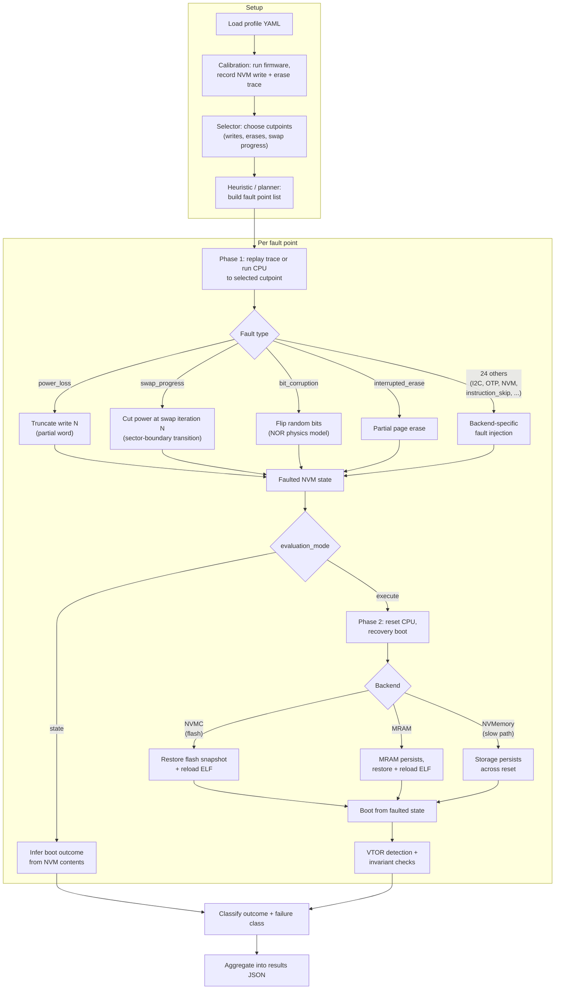

# tardigrade

Fault-injection and security-invariant testing for embedded update systems. Tardigrade drives storage, CPU, bus, and OTP faults through firmware update paths under [Renode](https://renode.io/) emulation, then checks recovery and security postconditions -- going beyond boot/no-boot to catch state-correctness bugs that do not necessarily brick the device.

Trace replay avoids repeated prefix emulation, while address-aware heuristics
can substantially reduce routine power-loss campaign size. Actual savings and
runtime are target-dependent. Width-aware, operation-accurate backends can emit
write traces with the access width, allowing byte-exact writeback reconstruction
and replay; legacy traces require an explicitly declared fixed width. A backend
that explicitly declares `PerWriteAccurate=false` is refused for writeback
replay. Declarative analyzers cover update-artifact authentication,
authenticated-content equivalence,
reviewed-versus-signed authorization, persistent security state, and
optimized-build assertion loss. An optional CBMC bridge connects formal
verification to empirical testing by converting counterexamples into replay
profiles.

## Findings

### NuttX nxboot -- original discovery

A historical Tardigrade campaign against the upstream [NuttX nxboot bootloader](https://github.com/apache/nuttx-apps/tree/45d4c7098bb3a7a6d9b5642efc47df5998c048d5/boot/nxboot) found a power-loss recovery vulnerability: 92 of 94 tested fault points resulted in the bootloader jumping to partially-written firmware. Three fixes were submitted:

| Fix                                                                                         | PR                                                                       |
| ------------------------------------------------------------------------------------------- | ------------------------------------------------------------------------ |
| FTL layer ignores `O_DIRECT` flag -- writes buffered in RAM despite explicit bypass request | [apache/nuttx#18552](https://github.com/apache/nuttx/pull/18552)         |
| Missing flush barriers between critical partition writes in nxboot                          | [apache/nuttx-apps#3428](https://github.com/apache/nuttx-apps/pull/3428) |
| Boot decision validates header only, not image CRC                                          | [apache/nuttx-apps#3428](https://github.com/apache/nuttx-apps/pull/3428) |

The FTL `O_DIRECT` bug affects all NuttX applications that write to MTD partitions expecting direct access, not just nxboot.

### MCUboot -- retroactive validation

These are retroactive tests against known MCUboot bugs, not discoveries. The point is showing that tardigrade's generic sweep catches real bug classes without target-specific tuning:

| PR                                                      | Bug                                                                 | Historical broken run | Fixed control |
| ------------------------------------------------------- | ------------------------------------------------------------------- | --------------------- | ------------- |
| [#2100](https://github.com/mcu-tools/mcuboot/pull/2100) | Revert magic left in bad state (swap-move)                          | 3 bricks (9.7%)      | 0 bricks |
| [#2109](https://github.com/mcu-tools/mcuboot/pull/2109) | Header reload from wrong slot after interrupted swap (swap-scratch) | 19 bricks (33.3%)    | 0 bricks |
| [#2199](https://github.com/mcu-tools/mcuboot/pull/2199) | Stuck revert: primary trailer never cleared (swap-move)             | 1 wrong_image (100%) | 0 issues |

Additional differential profiles for PRs [#2205](https://github.com/mcu-tools/mcuboot/pull/2205), [#2206](https://github.com/mcu-tools/mcuboot/pull/2206), and [#2214](https://github.com/mcu-tools/mcuboot/pull/2214).

## Integrations

### Fuzzer bridge

[`scripts/fuzz_crash_to_profile.py`](scripts/fuzz_crash_to_profile.py) converts libFuzzer/AFL/honggfuzz crash artifacts into tardigrade regression profiles. When a fuzzer finds a crash that corrupts an OTA header or metadata region, the bridge tests whether the corruption actually bricks the device or whether the bootloader recovers. Pipeline: `fuzzer finds crash` → `fuzz_crash_to_profile.py` → `tardigrade sweep from corrupted state`. Supports batch mode, staging-image injection, and auto-detection of fuzzer types.

### Formal verification bridge (CBMC)

[`scripts/cbmc_to_profile.py`](scripts/cbmc_to_profile.py) converts CBMC counterexamples into tardigrade replay profiles. CBMC proves a fault sequence _could_ cause corruption at the source level; tardigrade runs the compiled firmware under that sequence to confirm whether it manifests in practice. The bridge maps source-level state violations to NVM write indices using the counterexample's variable traces and the calibration write log.

### Declarative update-protocol analysis

[`scripts/update_protocol_analyzer.py`](scripts/update_protocol_analyzer.py) enumerates the paths through a declared update protocol, including optional event groups, and checks that every commit follows required policy gates, metadata bindings, and authenticated-content coverage. The model is vendor-neutral and evidence-limited: a clean result says the declaration is internally safe, not that the declaration matches a particular implementation.

```bash
python3 scripts/update_protocol_analyzer.py \
  --profile profiles/update_protocol_artifact_binding_fixed.yaml \
  --json
```

### Authenticated-content equivalence

[`scripts/authenticated_equivalence.py`](scripts/authenticated_equivalence.py)
runs a grammar-aware, black-box campaign against a supplied parser or harness.
It supports legacy duplicate/reorder mutations and declarative coupled
post-authentication copy/patch/replace cases, mutates only records after both
the declared authentication boundary and signature record, and compares
canonical semantic outcomes while failing closed on malformed evidence or
authenticated-identity drift. Findings are semantic divergences in the
supplied harness; the campaign does not claim to discover cryptographic
weaknesses. See
[`docs/authenticated-equivalence.md`](docs/authenticated-equivalence.md) and
the synthetic fixtures in
[`examples/authenticated_equivalence/`](examples/authenticated_equivalence/).

### Pre-authentication nested-header bounds

[`scripts/preauth_bounds_oracle.py`](scripts/preauth_bounds_oracle.py) runs a
target-neutral, synthetic-only campaign for attacker-controlled total, used,
signature, and key lengths. Its independent layout model flags a
`PREAUTH_BOUNDS_ESCAPE` when invalid nested extents reach signature/key
consumption or cryptographic verification, even if the parser later rejects
the input. See [`docs/preauth-bounds-oracle.md`](docs/preauth-bounds-oracle.md)
and the original minimal vulnerable/fixed fixtures in
[`examples/preauth_bounds_oracle/`](examples/preauth_bounds_oracle/).

### Freshness-aware metadata state

[`scripts/freshness_oracle.py`](scripts/freshness_oracle.py) models synthetic
update protocols in which installed image state and authenticated metadata can
advance through separate channels. It exercises time advancement, refresh
failure, and expiry-aware acceptance/commit/rollback decisions. It also flags
accepted selections that regress an independently advanced installed channel,
even while the metadata remains within its wall-clock validity period. See
[`examples/freshness_oracle/`](examples/freshness_oracle/).

## Core campaign capabilities

### Trace replay engine

Naive fault injection re-emulates the entire firmware prefix for each fault
point, producing O(N^2) total emulation for N points. For supported power-loss
campaigns, Tardigrade records a write trace during calibration and replays the
prefix instead of re-emulating Phase 1. The target and host determine the
resulting runtime savings.

Width-bearing rows record `write_index`, `flash_offset`, `value`, and `width`
(`1`, `2`, `4`, or `8` bytes). This preserves the access granularity needed for
byte-exact writeback reconstruction; traces without a width are accepted only
when the backend separately declares their fixed archived width.

### Write-address heuristic

Not all NVM writes are equally interesting. The heuristic classifier
(`scripts/write_trace_heuristic.py`) analyzes write addresses and groups them
into tiers: trailer metadata (exhaustive coverage), slot boundaries (dense
sampling), and bulk data copies (sparse sampling). This concentrates routine
campaigns on writes more likely to expose state-machine corruption; the actual
reduction is target-dependent.

### Semantic assertions beyond boot/no-boot

A device that boots to the wrong slot, confirms a corrupt image, or gets stuck in a revert loop is not "working." Tardigrade's state probes, semantic assertions, and composable invariant providers catch state-correctness bugs that pass a naive boot check. PR #2199 (stuck revert) is an example: the device boots, but it boots the wrong image permanently. Tardigrade catches it.

Instruction-skip sweeps can also attach verification bypass probes that record per-function return values instead of relying only on the final boot outcome. This lets tardigrade separate noisy CPU crashes from defense-in-depth catches and true full verification bypasses, which cuts down the false positives that otherwise show up in glitch-style campaigns.

Execute-mode `rc_injection` rejects a selected write and forces a configured
return value when a named wrapper returns. General `function_return_probes`
capture first, last, or all calls; the `success_implies_effect` invariant then
checks that a successful API return produced its declared persistent effect.
Other built-ins enforce atomic state groups, monotonic fields, and
cross-component state relations. The `persistent_state_fail_closed` invariant
checks that a failed persistent-state read cannot be followed by a write or an
accepted, committed, or booted outcome; incomplete telemetry is an evaluation
error rather than a finding.

### Reviewed-versus-signed authorization

The vendor-neutral `authorization_review` analyzer compares observed parsed,
reviewed, digested, signed, and authorized value identities. It fails closed
when required trace evidence is missing or incomplete; it consumes supplied
JSON traces and does not automatically extract vendor traces from firmware.

The vulnerable and fixed fixtures are [`profiles/authorization_review_vulnerable.yaml`](profiles/authorization_review_vulnerable.yaml) with [`examples/authorization_review/vulnerable_trace.json`](examples/authorization_review/vulnerable_trace.json), and [`profiles/authorization_review_fixed.yaml`](profiles/authorization_review_fixed.yaml) with [`examples/authorization_review/fixed_trace.json`](examples/authorization_review/fixed_trace.json).

```bash
python3 scripts/authorization_review_analyzer.py \
  --profile profiles/authorization_review_fixed.yaml \
  --trace examples/authorization_review/fixed_trace.json \
  --json
```

The fixed fixture reports `PASS`; substitute the vulnerable profile and trace
to see the reviewed-versus-signed mismatch finding.

To create a starting point for collecting runtime evidence for every expanded
sequence path, emit incomplete trace templates:

```bash
python3 scripts/authorization_review_analyzer.py \
  --profile profiles/my_profile.yaml \
  --emit-trace-template-dir traces/authorization
```

Template files contain the exact model digest and sequence name, ordered event
occurrences, and empty evidence placeholders. The command only writes files
and warns that they are incomplete observations; it does not run analysis or
produce a verdict. Existing output files are never overwritten.

### Security-state and emitted-code campaigns

`persistent_state_layout` maps monotonic-security, authorization, secret,
recovery, and mutable fields to physical erase units. The offline analyzer flags risky
co-location, while the `security_state_erase` selector creates power-loss
cutpoints around erase and restoration boundaries. `boundary_campaigns`
expands logical counters around zero, storage capacity, and integer limits,
with optional lower-value follow-ups that verify rejection and persistence.

For CPU-fault campaigns, `terminal_error_paths` derives direct calls and tail
branches to fatal handlers from the emitted ELF. A finding requires a terminal
control run, an applied instruction skip against the same artifact and restored
state, and observation of a declared forbidden sink. Missing or ambiguous
evidence is inconclusive rather than clean.

### Write-back durability model

Real storage stacks often buffer writes in RAM before committing to flash. A bootloader that assumes write-through durability can have latent bugs invisible to direct fault injection. The optional `durability_model: writeback` mode reconstructs the persisted Phase 2 snapshot from a bounded operation trace: writes remain pending until a configured barrier or capacity eviction commits them, and a power cut discards the rest. Phase 1 still observes the live write-through view, so the model evaluates recovery durability without claiming to reproduce same-boot stale reads. Ambiguous or unavailable trace evidence fails closed. Replay refuses a backend that explicitly declares `PerWriteAccurate=false`, because address-difference traces cannot establish operation ordering for durability reconstruction.

Diagnostic annotations include a barrier audit (detects missing flush barriers between update phases), per-fault dirty-domain state, and a `commit_ratio` metric that quantifies how much of the write stream is uncommitted at each fault point.

The current-head MCUboot STM32F4 scratch entry point is
[`profiles/mcuboot_head_scratch_stm32f4_writeback.yaml`](profiles/mcuboot_head_scratch_stm32f4_writeback.yaml).
Run it with the normal audit CLI after the current-head assets are available:

```bash
python3 scripts/audit_bootloader.py \
  --profile profiles/mcuboot_head_scratch_stm32f4_writeback.yaml \
  --renode-test /path/to/renode-test
```

For real NuttX nxboot artifacts, the runtime profile generator exposes the
`sector_boundary_writeback` campaign; see the command in
[`targets/nuttx_nxboot/README.md`](targets/nuttx_nxboot/README.md).

## Quick start

### GitHub Action

```yaml
- id: tardigrade
  uses: neilberkman/tardigrade@<reviewed-commit-sha>
  with:
    profile: path/to/your/profile.yaml
    quick: false
    workers: 2
```

Outputs include `verdict` (PASS/FAIL), `security-status` (CLEAN/FINDINGS/
INCONCLUSIVE), `assertion-status`, `issue-points`, `security-bypass-points`,
`report-path`, and `brick-rate`. By default, `verdict` is a fail-safe security
gate: it is PASS only when the profile expects no issues, no issues were found,
the evidence is complete, and the CLI assertion passed.

Known-vulnerable profiles used as regression tests must opt in explicitly with
`regression-mode: true`. In that mode, `verdict` is PASS only when the
regression assertion passes, `security-status` is `FINDINGS`, and the evidence
has no inconclusive reasons. Do not use regression mode as a release security
gate.

Relative ELF, image, platform, setup, and hook paths are resolved from the
caller's workspace. Set `asset-root` to a workspace subdirectory when those
assets do not live at the repository root. A custom `renode-url` must be paired
with its exact `renode-sha256`; downloads are rejected before extraction when
the digest does not match. The default digest comes from Renode's public
v1.16.1 release metadata. The Action also enables strict profile validation,
so unknown keys and profiles without observable success criteria are rejected.
The bundled runtime supports Linux x86-64 runners. It uses Renode's verified
portable .NET archive and installs Python packages in a temporary virtual
environment, leaving the caller's Python environment intact.

Profiles are trusted executable input, not a sandbox. Platform definitions,
setup scripts, boot hooks, and invariant providers can execute Renode commands
or host Python. Run only profiles and referenced assets from reviewed,
open-source revisions; do not accept them directly from an untrusted pull
request or artifact.

```yaml
- name: Upload tardigrade report
  if: always()
  uses: actions/upload-artifact@ea165f8d65b6e75b540449e92b4886f43607fa02 # v4.6.2
  with:
    name: tardigrade-report
    path: ${{ steps.tardigrade.outputs.report-path }}
```

See [`action.yml`](action.yml) for all inputs and outputs.

### Local

For a step-by-step walkthrough, see the [Getting Started guide](docs/getting-started.md).

Prerequisites: Python 3.10+, `python3 -m pip install -r requirements.txt`, and
either `renode-test` on PATH or Docker.

```bash
python3 scripts/audit_bootloader.py \
  --profile profiles/mcuboot_pr2100_broken.yaml \
  --renode-test /path/to/renode-test \
  --output results/report.json
```

By default, `--quick` selects the first, middle, and last point independently
for each enabled fault family or selector, so mixed campaigns can run more than
three points. With `quick_use_heuristic: true`, write-indexed faults use the
heuristic-selected set and the ordinary three-point reductions are not applied
to other enabled families. Add `--workers N` for parallelism. Build the public
validation container with
`docker build -f docker/oss-validation.Dockerfile -t tardigrade-oss-validation .`,
then use `--renode-test docker://tardigrade-oss-validation`.

The experimental MCUboot bulk-write state evaluator is disabled for CLI
audits by default because it predicts recovery from reconstructed flash state.
Use `--allow-mcuboot-state-evaluator` only for explicitly reviewed campaigns;
direct Python API callers may still opt in with `allow_state_evaluator=True`.

### Run modes

| Mode       | Selection                                       | Typical points      | Use case               |
| ---------- | ----------------------------------------------- | ------------------- | ---------------------- |
| Quick      | CLI `--quick`                                   | Up to 3 per enabled family by default | smoke only |
| Heuristic  | profile `fault_sweep.sweep_strategy: heuristic`  | target-specific     | normal CI / canary     |
| Exhaustive | profile `fault_sweep.sweep_strategy: exhaustive` | every planned point | deep manual validation |

## How it works

### Fault injection model


```mermaid
flowchart TD
    subgraph setup["Setup"]
        A["Load profile YAML"] --> B["Calibration: run firmware,<br/>record NVM write + erase trace"]
        B --> C["Selector: choose cutpoints<br/>(writes, erases, swap progress)"]
        C --> D["Heuristic / planner:<br/>build fault point list"]
    end

    D --> E

    subgraph pf["Per fault point"]
        E["Phase 1: replay trace or run CPU<br/>to selected cutpoint"] --> F{"Fault type"}
        F -->|power_loss| G["Truncate write N<br/>(partial word)"]
        F -->|swap_progress| G2["Cut power at swap iteration N<br/>(sector-boundary transition)"]
        F -->|bit_corruption| H["Flip random bits<br/>(NOR physics model)"]
        F -->|interrupted_erase| I["Partial page erase"]
        F -->|"24 others<br/>(I2C, OTP, NVM,<br/>instruction_skip, ...)"| J["Backend-specific<br/>fault injection"]

        G --> K["Faulted NVM state"]
        G2 --> K
        H --> K
        I --> K
        J --> K

        K --> L{"evaluation_mode"}

        L -->|state| M["Infer boot outcome<br/>from NVM contents"]
        L -->|execute| N["Phase 2: reset CPU,<br/>recovery boot"]

        N --> O{"Backend"}
        O -->|"NVMC<br/>(flash)"| P["Restore flash snapshot<br/>+ reload ELF"]
        O -->|"MRAM"| Q["MRAM persists,<br/>restore + reload ELF"]
        O -->|"NVMemory<br/>(slow path)"| R["Storage persists<br/>across reset"]

        P --> S["Boot from faulted state"]
        Q --> S
        R --> S
        S --> T["VTOR detection +<br/>invariant checks"]
    end

    M --> U
    T --> U
    U["Classify outcome + failure class"] --> V["Aggregate into results JSON"]
```

1. **Trigger discovery** -- if the profile does not already seed a `pre_boot_state`, tardigrade can try a short trigger cascade (`no_trigger`, trailer magic, trailer metadata, offset placement) until calibration reaches real slot data movement. When bounded trace evidence is unavailable, discovery can instead accept an exact configured nonzero marker or independently derived target-image hash. That content must match the declared target, differ from the starting exec image, and accompany an explicit successful boot, current halted-state VTOR and PC values satisfying the declared slot constraints, satisfied runtime expectations, and positive flash activity. MCUboot profiles also get a compiled flash-map preflight: mismatches between the ELF's slot layout and the declared slots fail fast instead of looking "clean." Nonuniform or partially covered erase-sector geometry remains an advisory diagnostic for intentional geometry-specific profiles.
2. **Calibration** -- run the firmware once, count total NVM writes, capture the resulting boot evidence, and record write/erase traces when available.
3. **Cutpoint selection** -- choose candidate fault points from the clean trace or the available runtime counts. Trace-backed selection includes raw write indices, erase indices, semantic `swap_progress` boundaries, and security-state erase/restoration boundaries; trace-less runs omit selectors that cannot be derived safely.
4. **Heuristic pruning** -- classify write-indexed points by address into tiers, often reducing routine campaign size.
5. **Phase 1** -- replay the clean trace where supported, or execute the CPU to the selected cutpoint, then inject the fault. Trace replay eliminates O(N^2) prefix re-emulation for eligible power-loss points.
6. **Phase 2** -- `execute` mode resets the CPU and performs a full recovery boot from faulted NVM; `state` mode infers the outcome from NVM contents alone.
7. **Follow-up cycles / hooks** -- optional repeated boots and between-cycle hook actions model confirm-or-rollback flows and staged recovery.
8. **Classification** -- boot outcomes (`success`, `wrong_image`, `no_boot`, `wrong_pc`, `hard_fault`, `timeout`) and failure classes (`recoverable`, `wrong_image`, `silent_corruption`, `unrecoverable`). A `timeout` means the bootloader was still actively working when the wall-clock budget expired -- this is not counted as a failure.

### Fault types

28 implemented fault types and semantic selectors across 8 backend categories:

| Category        | Fault types                                                                                                                                                                                    | Backend requirement                         |
| --------------- | ---------------------------------------------------------------------------------------------------------------------------------------------------------------------------------------------- | ------------------------------------------- |
| NVM write/erase | `power_loss`, `swap_progress`, `security_state_erase`, `bit_corruption`, `interrupted_erase`, `silent_write_failure`, `write_disturb`, `write_rejection`, `multi_sector_atomicity`, `wear_leveling_corruption` | Flash/MRAM capability-dependent             |
| NVM read/time   | `read_bit_flip`, `reset_at_time`, `timed_bit_corruption`                                                                                                                                       | NVMemory/MRAM for read faults; reset is all |
| NVM controller  | `command_drop`                                                                                                                                                                                 | GenericNvmController                        |
| NVM region      | `nvs_corruption`                                                                                                                                                                               | Declared NVS region                         |
| CPU glitch      | `instruction_skip`                                                                                                                                                                             | Arm execute mode                            |
| Driver error    | `driver_error`, `rc_injection`                                                                                                                                                                 | Instrumented driver / Arm execute mode      |
| I2C bus         | `i2c_nack`, `i2c_timeout`, `i2c_bit_flip`, `i2c_truncated`, `i2c_wrong_address`                                                                                                                | I2CFaultProxy                               |
| OTP fuse        | `otp_partial_program`, `otp_stuck_bit`, `otp_read_disturb`, `otp_overblow`, `otp_blow_nop`                                                                                                     | OTPMemory                                   |

Faults can be injected at different lifecycle stages: during the initial update write path, during pre-boot metadata/setup writes (`metadata_fault`), during between-boot confirm/accept hooks (`hook_fault`), during the recovery write path itself (`phase2_fault`), or as compound sequences (`multi_fault`). The optional `durability_model: writeback` currently supports ordinary trace-reconstructable write paths. Lifecycle/compound and erase-atomicity combinations are rejected as incomplete until their persisted-state provenance can be reconstructed safely.

`swap_progress` uses calibration erase data to find real sector-boundary transitions in slot traffic, then reuses the normal power-cut replay path at those boundaries. On platforms where an erase trace is unavailable, tardigrade falls back to uniform `memory.page_size` buckets, which is usable on uniform flash and only approximate on non-uniform layouts. `security_state_erase` is also a semantic power-loss selector; it targets erase and restoration boundaries for declared persistent security fields.

Clean verdicts are coverage-gated. If calibration shows trailer-only activity, flash traffic outside the declared slots, or no NVM activity at all, tardigrade reports that as a failed/inconclusive setup instead of a clean `PASS`.

Trigger discovery is coverage-gated too. A strategy normally "wins" when calibration reaches slot data movement. If no bounded NVM trace is available, an exact target-content observation may select the trigger under the stricter checks described above; trace-dependent semantic points such as swap-progress boundaries remain unavailable. Trailer-only writes mean the bootloader noticed the trigger but rejected the image; zero writes mean the update path never ran. If every strategy fails, tardigrade returns `INCONCLUSIVE -- could not trigger firmware update` instead of pretending the bootloader is clean.

### Execute-mode hardening

In `execute` mode, Phase 2 performs a full CPU recovery boot from faulted NVM:

- **VTOR polling** detects which slot the bootloader jumped to.
- **5ms confirmation window + CFSR HardFault check** verifies boot stability.
- **Sticky fault signal** (`FaultEverFired`) survives subsequent writes and resets.
- **Write stabilization early-exit** reduces per-point runtime when writes settle.
- **No-boot introspection** emits partition post-mortem dumps and per-operation PC traces for `no_boot` outcomes.

### Performance

- **Trace replay** -- recorded prefixes replace repeated Phase 1 emulation where supported
- **Cached flash restore** -- single `WriteBytes` per fault point instead of per-page erase+load
- **Hash bypass** -- patches out crypto validation on faulted sweep runs via `sweep_hash_bypass_symbols`
- **Parallel workers** -- `--workers N` distributes fault points across N Renode instances
- **Heuristic pruning** -- address-aware tiers reduce routine point sets by a target-dependent amount
- **Interleaved distribution** -- round-robin assignment balances load across workers

## Profile-driven architecture

Sweeps are profile-driven YAML -- describe the memory layout, slots, images, and success criteria. Advanced semantic checking (state probes, custom invariants, boot register capture, write-order constraints) requires small Python hooks. A `security_policy` block models anti-rollback floors, minimum version enforcement, and TOCTOU protection for adversarial fault scenarios. Optional `update_protocol`, `authorization_review`, `persistent_state_layout`, and `boundary_campaigns` blocks add declarative security-path analysis and campaign expansion.

Use `target_source` when a target artifact comes from another checkout so its explicitly supplied revision is retained in reports, including containerized runs. Use `expect.mode: exploratory` or `hunt` for campaigns that are intended to explore rather than require findings.

For upgrade-style profiles, the preferred starting point is minimal: ELF, slot layout, images, and success criteria. If you omit `pre_boot_state` and either omit `update_trigger` or set `update_trigger: auto`, tardigrade will try to discover the update trigger automatically before the real sweep.

See **[`docs/writing-profiles.md`](docs/writing-profiles.md)** for the complete profile-writing guide: field-by-field reference, platform selection, success criteria options, invariant configuration, and result interpretation.

## Supported targets

### Real upstream integrations

**MCUboot** -- narrow canary profiles against MCUboot HEAD, retroactive differential profiles for 6 known bugs (broken/fixed pairs for PRs #2100, #2109, #2199, #2205, #2206, #2214), geometry-variant profiles, and multi-step exploratory scenarios with semantic probes and invariant checking. Platforms include nRF52840 (NVMC) and STM32F4. The MCUboot differentials cover three distinct fault-resilience bug classes (revert-magic corruption, header-reload-after-resume, stuck-revert-trailer) -- each was also checked against the other swap algorithms to test for cross-algorithm variants. See `profiles/mcuboot_*.yaml` and [`targets/mcuboot/`](targets/mcuboot/).

The current-head STM32F4 swap-scratch profiles use dedicated mirrored-bank
assets. Their 2 MiB STM32F429 layout places 224 KiB slots at `0x08008000` and
`0x08108000`, with a 128 KiB scratch sector at flash offset `0x40000`; the
slots each span the final two of a bank's four 16 KiB sectors, its 64 KiB
sector, and one 128 KiB sector. These assets are separate from the historical
PR2205 images, which intentionally retain their older asymmetric layout.

To rebuild the MCUboot matrix assets, make an Arm GNU toolchain available,
bootstrap the pinned Zephyr and MCUboot workspace, and then run the matrix
builder:

```bash
export GNUARMEMB_TOOLCHAIN_PATH=/path/to/arm-gnu-toolchain
./scripts/bootstrap_mcuboot_matrix_assets.sh
./scripts/build_mcuboot_head_matrix.sh
```

The build script writes the generated ELFs and signed slot images under
`results/oss_validation/assets/`. The normal and fast STM32F4 profiles share
the current-head bootloader and mirrored slot images; the fast profile changes
the Renode backend for execute-mode performance. The dedicated
[`mcuboot_head_scratch_stm32f4_writeback.yaml`](profiles/mcuboot_head_scratch_stm32f4_writeback.yaml)
profile applies the writeback durability model to this current-head geometry.

**NuttX nxboot** -- real upstream NuttX firmware built from source. Board configs are upstream ([apache/nuttx#18509](https://github.com/apache/nuttx/pull/18509)). Tardigrade found a power-loss recovery vulnerability (92/94 failure rate) that led to fixes in both the NuttX kernel ([#18552](https://github.com/apache/nuttx/pull/18552)) and nxboot itself ([nuttx-apps#3428](https://github.com/apache/nuttx-apps/pull/3428)). The target adapter (`targets/nuttx_nxboot/`) includes a build script, runtime profile generator, and state probe. See [`targets/nuttx_nxboot/`](targets/nuttx_nxboot/).
The generator's `--campaign sector_boundary_writeback` preset emits a
three-boot, power-loss profile using the sector-boundary image and writeback
durability settings; it is a campaign entry point, not a new upstream finding.

**rustBoot** -- an independent state probe and invariant package for the public
MIT-licensed rustBoot partition/trailer protocol. No rustBoot prebuilt firmware
is distributed. See [`targets/rustboot/`](targets/rustboot/) and
[`docs/rustboot-target.md`](docs/rustboot-target.md) for the adapter reference.

**Trusted Firmware-M BL2** -- a four-slot probe, multi-image acceptance
invariants, persisted-snapshot evaluator, and path-neutral native-run template
for locally built dual-image TF-M BL2 on MPS2 AN521. No TF-M firmware binary is
distributed. The AN521 platform currently provides update-state observation,
fault instrumentation, and register-driver compatibility; it does not validate
live SAU/MPC memory isolation. See [`targets/tf_m_bl2/`](targets/tf_m_bl2/).

### Reference examples

The `examples/` directory contains standalone firmware plus declarative models
and trace fixtures for engine validation and self-testing:

| Example                  | Purpose                                                            |
| ------------------------ | ------------------------------------------------------------------ |
| `authorization_review`   | Reviewed-versus-signed declarative model and trace fixtures         |
| `authenticated_equivalence` | Grammar-aware authenticated-content equivalence fixtures         |
| `freshness_oracle`       | Authenticated-metadata expiry and split-channel regression fixtures |
| `preauth_bounds_oracle` | Synthetic nested-header pre-authentication bounds fixtures        |
| `naive_copy`             | Worst-case baseline; proves the engine catches obvious brick paths |
| `vulnerable_ota`         | Copy-in-place OTA with frequent boot-visible failures              |
| `nxboot_style`           | Modeled nxboot family for adapter/probe/invariant development      |
| `esp_idf_ota`            | Standalone model of ESP-IDF OTA slot-selection behavior            |
| `bootloader_self_update` | Bootloader-region integrity and self-update fault modeling         |
| `nvs_config_migration`   | Config/NVS-region corruption and migration validation              |
| `firmware_otp_harness`   | OTP programming and fuse-fault validation                          |
| `cbmc_bridge`            | Formal-counterexample and crash-input conversion fixtures          |
| `fuzzer_harness`         | End-to-end parser fuzzing and regression-profile example           |
| `persistent_state_fail_closed` | Failed persistent-state read/write outcome fixtures          |

## Report structure

The CLI report's top-level `verdict` is an expectation assertion and begins
with `PASS`, `FAIL`, or `INCONCLUSIVE`. A `PASS` can mean that a deliberately
vulnerable regression profile produced the expected findings. The separate
`security_aggregate.status` is `CLEAN`, `FINDINGS`, or `INCONCLUSIVE` across
runtime, multi-component, boundary, terminal-error, and authorization
evidence. The GitHub Action combines both values into its binary `verdict`
output and requires `CLEAN` unless `regression-mode` is explicitly enabled.

For runtime sweeps, `bricks` counts unrecoverable failures, `issue_points`
includes broader mismatches (wrong slot, semantic assertions, and invariant
violations), and `timeout_points` counts points where the bootloader was still
working when the wall-clock budget expired. Timeouts are not failures; increase
`run_duration` to resolve them. Common boot outcomes are `success`,
`wrong_image`, `no_boot`, `wrong_pc`, `hard_fault`, and `timeout`. Clean runtime
evidence also requires calibration coverage: if the bootloader never moves
slot data during calibration, tardigrade reports an incomplete setup rather
than claiming the bootloader is clean.

See **[`docs/writing-profiles.md`](docs/writing-profiles.md)** for the full report JSON structure and how to interpret results.

## Additional tools

- **Scenarios** ([`scripts/run_scenario.py`](scripts/run_scenario.py)) -- multi-step discovery runs with profile overrides per step. See [`scenarios/`](scenarios/).
- **CBMC bridge** ([`scripts/cbmc_to_profile.py`](scripts/cbmc_to_profile.py)) -- converts CBMC counterexamples into tardigrade replay profiles, bridging formal verification and empirical fault injection.
- **Fuzzer bridge** ([`scripts/fuzz_crash_to_profile.py`](scripts/fuzz_crash_to_profile.py)) -- converts libFuzzer/AFL/honggfuzz crash inputs into regression profiles; supports batch mode, staging-image injection, and auto-detection of fuzzer types. Workflow helpers live in [`scripts/fuzz_corpus.py`](scripts/fuzz_corpus.py), with an end-to-end template in [`examples/fuzzer_harness/`](examples/fuzzer_harness/). Legacy converter: `scripts/fuzz_to_profile.py`.
- **Fuzzer harness preflight** ([`scripts/fuzzer_harness.py`](scripts/fuzzer_harness.py)) -- validates a known-valid seed and known-invalid control before a parser campaign. Setup errors, aborts, timeouts, malformed evidence, and mismatched controls are infrastructure failures, never findings.
- **Geometry matrix** ([`scripts/geometry_matrix.py`](scripts/geometry_matrix.py)) -- parametric slot-layout permutations to catch geometry-dependent bugs.
- **State fuzzer** -- structured metadata-state fuzzing via the `state_fuzzer` profile block, plus the MCUboot-specific scenario generator in [`targets/mcuboot/state_fuzzer.py`](targets/mcuboot/state_fuzzer.py).
- **Update-protocol analyzer** ([`scripts/update_protocol_analyzer.py`](scripts/update_protocol_analyzer.py)) -- checks declarative commit paths for required security gates, metadata bindings, and authenticated content.
- **Authenticated-equivalence campaign** ([`scripts/authenticated_equivalence.py`](scripts/authenticated_equivalence.py)) -- supports legacy duplicate/reorder and declarative coupled post-authentication copy/patch/replace mutations, then compares canonical semantic outcomes while preserving the authenticated identity. Explicit before/after evidence can also expose persistent security-state changes caused by rejected mutants. See [`docs/authenticated-equivalence.md`](docs/authenticated-equivalence.md).
- **Pre-authentication bounds oracle** ([`scripts/preauth_bounds_oracle.py`](scripts/preauth_bounds_oracle.py)) -- mutates synthetic nested-header length fields and detects extent escapes before signature/key consumption. See [`docs/preauth-bounds-oracle.md`](docs/preauth-bounds-oracle.md) and [`examples/preauth_bounds_oracle/`](examples/preauth_bounds_oracle/).
- **Authorization-review analyzer** ([`scripts/authorization_review_analyzer.py`](scripts/authorization_review_analyzer.py)) -- compares observed parsed, reviewed, digested, signed, and authorized values using complete trace evidence.
- **NuttX runtime profile generator** ([`targets/nuttx_nxboot/generate_runtime_profile.py`](targets/nuttx_nxboot/generate_runtime_profile.py)) -- emits `baseline`, `sector_boundary_resume`, `metadata_erase_resume`, and `sector_boundary_writeback` profiles from built nxboot artifacts.
- **Production-assert analyzer** ([`scripts/production_assert_analyzer.py`](scripts/production_assert_analyzer.py)) -- identifies Python assertions that disappear under optimization and need reachability and impact review; candidates are not confirmed vulnerabilities.
- **Persistent-state layout analyzer** ([`scripts/security_state_layout.py`](scripts/security_state_layout.py)) -- maps declared fields to erase units and identifies security state co-located with mutable or recovery data.
- **HTML report** ([`scripts/render_results_html.py`](scripts/render_results_html.py)) -- renders JSON reports as HTML.

## CI workflows

| Workflow                              | Trigger                  | What it does                          |
| ------------------------------------- | ------------------------ | ------------------------------------- |
| `ci.yml`                              | push, PR                 | License gate, Robot/pytest, self-test |
| `profile-sweep.yml`                   | workflow_dispatch        | On-demand single-profile sweep        |
| `action-validation.yml`               | push, PR                 | Validates the reusable GitHub Action  |
| `oss-validation.yml`                  | path-filtered push to `main`, schedule, dispatch | OSS validation guards |
| `mcuboot-head-exploratory.yml`        | workflow_dispatch        | MCUboot exploratory scenario          |
| `nuttx-nxboot-real-exploratory.yml`   | workflow_dispatch        | Real NuttX nxboot exploratory sweep   |
| `nuttx-nxboot-revert-canary.yml`      | schedule, dispatch       | NuttX revert property canary          |
| `nuttx-nxboot-multi-fault-canary.yml` | schedule, dispatch       | NuttX nxboot multi-fault sweep canary |
| `renode-latest-canary.yml`            | schedule, dispatch       | Tests against latest Renode build     |

## Repository layout

```text
tardigrade/
├── action.yml                        # Reusable GitHub Action
├── scripts/
│   ├── audit_bootloader.py           # Primary CLI entry point
│   ├── run_scenario.py               # Multi-step scenario runner
│   ├── profile_loader.py             # YAML profile parser + validation
│   ├── invariants.py                 # 19 named postcondition invariants
│   ├── self_test.py                  # Self-test across known defect corpus
│   ├── run_runtime_fault_sweep.resc  # Renode fault sweep engine
│   ├── write_trace_heuristic.py      # Write-trace classification
│   ├── writeback_reconstruction.py   # Durable snapshot reconstruction
│   ├── authenticated_equivalence.py  # Authenticated-content equivalence campaign
│   ├── preauth_bounds_oracle.py     # Synthetic pre-auth bounds oracle
│   ├── boot_cycle_analysis.py        # Multi-boot convergence analysis
│   ├── fault_inject.py               # Fault injection helpers
│   ├── partial_staging.py            # Partial staging-image simulation
│   ├── render_results_html.py        # HTML report renderer
│   ├── geometry_matrix.py            # Parametric slot-layout generator
│   ├── boundary_campaigns.py         # Security-counter boundary expansion
│   ├── security_state_layout.py      # Persistent erase-domain analysis
│   ├── terminal_error_escape.py      # Emitted-ELF terminal-path analysis
│   ├── update_protocol_analyzer.py   # Update gate/content-binding analysis
│   ├── authorization_review_analyzer.py # Reviewed-versus-signed analysis
│   ├── production_assert_analyzer.py # Optimized-build assertion review
│   ├── cbmc_to_profile.py            # CBMC counterexample converter
│   ├── fuzz_crash_to_profile.py      # Fuzzer crash-to-profile converter
│   ├── fuzz_to_profile.py            # Legacy fuzzer bridge
│   ├── run_oss_validation.py         # OSS validation runner
│   └── license_certify.py            # Strict source-release license gate
├── targets/
│   ├── esp_idf/                      # ESP-IDF model probe + invariants
│   ├── mcuboot/                      # MCUboot probe, invariants, state fuzzer
│   ├── nuttx_nxboot/                 # Real NuttX build + runtime profile gen
│   ├── nxboot/                       # Shared nxboot-style probe + invariants
│   ├── rustboot/                     # rustBoot probe + invariants
│   └── tf_m_bl2/                     # TF-M multi-image probe + evaluator
├── profiles/                         # YAML audit profiles (~180 profiles)
├── scenarios/                        # Multi-step scenario definitions
├── examples/                         # Reference firmware, models, and trace fixtures
├── harnesses/                        # Fuzzer harness templates
├── peripherals/                      # Renode C# peripherals with fault hooks
│   ├── NRF52NVMC.cs                  #   NVMC flash with write/erase faults
│   ├── NVMemoryController.cs         #   NVMemory slow-path backend
│   ├── GenericNvmController.cs       #   Command-register NVM controller
│   ├── I2CFaultProxy.cs              #   I2C bus fault injection proxy
│   ├── OTPMemory.cs                  #   OTP fuse-blow fault model
│   ├── STM32F4FlashController.cs     #   STM32F4 flash controller
│   ├── STM32H7FlashController.cs     #   STM32H7 flash controller
│   ├── An521NvmInterceptor.cs        #   AN521 RAM-backed NVM interception
│   ├── CMSDKAPBWatchdog.cs           #   CMSDK watchdog model
│   ├── Sse200MpcStub.cs              #   SSE-200 MPC register model
│   ├── TraceReplayEngine.cs          #   Trace replay for fast Phase 1
│   └── FaultTracker.cs               #   Shared fault-tracking + writeback overlay
├── platforms/                        # Renode platform definitions (.repl)
├── tests/                            # Robot Framework + pytest suites
├── docker/                           # Dockerfiles for CI
├── results/oss_validation/assets/    # Pre-built MCUboot ELFs + slot images
└── docs/
    ├── writing-profiles.md           # Profile-writing guide + result interpretation
    ├── authenticated-equivalence.md  # Authenticated-content campaign guide
    ├── preauth-bounds-oracle.md      # Synthetic pre-auth bounds guide
    ├── license-certification.md      # Strict source-package license boundary
    ├── rustboot-target.md            # rustBoot adapter reference
    ├── i2c-fault-model.md            # I2C fault injection model
    └── otp-backend.md                # OTP fuse-blow backend
```

## Limitations

- Storage power-loss faults operate at write/erase-operation granularity, not analog brownout simulation.
- The primary fault-sweep path is first-class for Cortex-M; auxiliary Cortex-A boot helpers are not integrated fault-sweep targets.
- Some fault types are backend-specific: `read_bit_flip` requires a backend that intercepts CPU reads (NVMemory or MRAMMemory -- fast-path backends like NVMC/STM32 expose flash via MappedMemory that the CPU reads directly); `command_drop` requires GenericNvmController; I2C faults require the I2CFaultProxy peripheral; OTP faults require the OTPMemory peripheral. The loader emits heuristic warnings for several obvious backend mismatches; runtime evidence remains coverage-gated.
- Multi-fault sweeps currently execute all stages as power-loss faults regardless of the original fault type.
- Runtime semantic bugs that do not change boot outcome require explicit target instrumentation or trace evidence.
- Campaign time varies substantially with target, fault types, recovery cycles, and worker count; the bundled power-loss profiles are reference points, not a general runtime guarantee.
- Declarative and static analyzers are evidence-limited and do not prove that a supplied model matches deployed firmware.

## Why "tardigrade"

Tardigrades survive vacuum, radiation, and temperature extremes. The name maps to the goal: OTA update paths that stay recoverable under harsh fault conditions.

## License

Apache 2.0. See [`LICENSE`](LICENSE). Required bundled notices and license
texts are indexed by [`THIRD_PARTY_NOTICES.md`](THIRD_PARTY_NOTICES.md).

The checked-in certification manifest defines a narrower
`tardigrade-core-source` release boundary, enforces exact file digests and
tracked-path classification, then checks the package's reviewer-supplied
license declaration against a strict no-copyleft policy:

```bash
python3 scripts/license_certify.py license-certification-manifest.json --strict
```

That result applies only to the declared source package. It does not certify
the full checkout, retained firmware fixtures, generated binaries, external
toolchains, emulators, or dependencies. See
[`docs/license-certification.md`](docs/license-certification.md) for the exact
boundary and refresh procedure.
